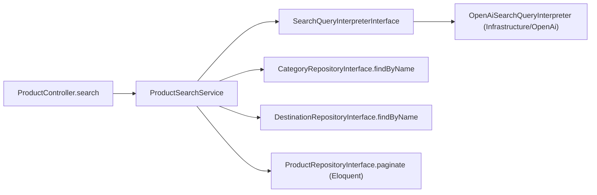

## Contract (matches the FE plan's assumption)

`POST /api/v1/products/search`, `auth:sanctum`, body `{ query, page, per_page }` -> same paginated `ProductResource` shape as `GET /products`.

## Layering



- `OpenAiSearchQueryInterpreter` only turns free text into a `ProductSearchFilters` DTO (keyword/category name/destination name/min/max price). It never sees pagination and has no `status` field, so it structurally cannot influence the Active/valid business rule.
- `ProductSearchService` resolves category/destination names to IDs via the repositories (ORM lookups), then builds a `ProductSearchCriteria` with `status` and `onlyValid` **hard-coded**, and calls the existing `ProductRepositoryInterface::paginate()` (Eloquent) to run the actual search.
- This is a distinct class from the existing `HttpContentGenerator`/`ContentGeneratorInterface` (used for AI product-field generation) per your request to keep OpenAI-search concerns in their own service.

## New files

- [`backend/app/DataTransferObjects/ProductSearchFilters.php`](backend/app/DataTransferObjects/ProductSearchFilters.php) - readonly DTO: `?string $keyword`, `?string $categoryName`, `?string $destinationName`, `?float $minPrice`, `?float $maxPrice`.
- [`backend/app/Contracts/Integrations/SearchQueryInterpreterInterface.php`](backend/app/Contracts/Integrations/SearchQueryInterpreterInterface.php) - `interpret(string $query): ProductSearchFilters`, `@throws IntegrationException`.
- [`backend/app/Infrastructure/OpenAi/OpenAiSearchQueryInterpreter.php`](backend/app/Infrastructure/OpenAi/OpenAiSearchQueryInterpreter.php) - implements the interface using Laravel's `Http` facade against OpenAI's Chat Completions endpoint with `response_format: json_object` and a system prompt instructing the model to return exactly `{keyword, category, destination, min_price, max_price}` (all nullable). Throws `IntegrationException` on a failed HTTP call or unparsable JSON.
- [`backend/app/Services/ProductSearchService.php`](backend/app/Services/ProductSearchService.php):
  - `search(string $query, int $page, int $perPage): LengthAwarePaginator`
  - Empty/whitespace query -> skip the AI call, use an empty filter set (pure browse).
  - Non-empty query -> call the interpreter; if it throws `IntegrationException`, degrade gracefully by treating the raw text as `keyword` instead of failing the request.
  - Resolve `categoryName`/`destinationName` to IDs via `CategoryRepositoryInterface::findByName` / `DestinationRepositoryInterface::findByName`; unmatched names are simply dropped (no 404).
  - Build `ProductSearchCriteria` with `status: ProductStatus::Active`, `onlyValid: true`, `userId: null` (catalog-wide, not owner-scoped) always, plus the resolved keyword/category/destination/min/max price and page/perPage.
  - Call `ProductRepositoryInterface::paginate($criteria)`.
- [`backend/app/Http/Requests/SearchProductRequest.php`](backend/app/Http/Requests/SearchProductRequest.php) - `authorize(): true`; rules: `query` sometimes|string|max:500, `page` sometimes|integer|min:1, `per_page` sometimes|integer|min:1|max:100.
- Tests:
  - [`backend/tests/Unit/ProductSearchServiceTest.php`](backend/tests/Unit/ProductSearchServiceTest.php) - fakes for all four interfaces; covers empty-query browse, name-to-id resolution, forced Active/onlyValid regardless of filters, and interpreter-exception fallback to keyword search.
  - [`backend/tests/Feature/ProductSearchControllerTest.php`](backend/tests/Feature/ProductSearchControllerTest.php) - binds a fake `SearchQueryInterpreterInterface` in the container (no real OpenAI calls); covers 401 unauthenticated, empty-query pagination, destination/price filtering, expired-product exclusion, inactive-product exclusion, and graceful fallback when the interpreter throws.

## Modified files

- [`backend/app/DataTransferObjects/ProductSearchCriteria.php`](backend/app/DataTransferObjects/ProductSearchCriteria.php) - add `?float $minPrice = null`.
- [`backend/app/Repositories/Eloquent/EloquentProductRepository.php`](backend/app/Repositories/Eloquent/EloquentProductRepository.php) - in `paginate()`, add `if ($criteria->minPrice !== null) { $query->where('price', '>=', $criteria->minPrice); }` alongside the existing `maxPrice` check.
- [`backend/app/Contracts/Repositories/CategoryRepositoryInterface.php`](backend/app/Contracts/Repositories/CategoryRepositoryInterface.php) + [`EloquentCategoryRepository.php`](backend/app/Repositories/Eloquent/EloquentCategoryRepository.php) - add `findByName(string $name): ?Category` using a case-insensitive `whereRaw('LOWER(name) = ?', [Str::lower($name)])`.
- [`backend/app/Contracts/Repositories/DestinationRepositoryInterface.php`](backend/app/Contracts/Repositories/DestinationRepositoryInterface.php) + [`EloquentDestinationRepository.php`](backend/app/Repositories/Eloquent/EloquentDestinationRepository.php) - same `findByName` addition for `Destination`.
- [`backend/app/Http/Controllers/Api/V1/ProductController.php`](backend/app/Http/Controllers/Api/V1/ProductController.php) - inject `ProductSearchService` alongside `ProductService`; add:
```php
public function search(SearchProductRequest $request): AnonymousResourceCollection
{
    $paginator = $this->search->search(
        query: (string) $request->input('query', ''),
        page: $request->integer('page', 1),
        perPage: $request->integer('per_page', 15),
    );

    return ProductResource::collection($paginator);
}
```
- [`backend/routes/api.php`](backend/routes/api.php) - add `Route::post('products/search', [ProductController::class, 'search']);` inside the `auth:sanctum` group.
- [`backend/app/Providers/DomainServiceProvider.php`](backend/app/Providers/DomainServiceProvider.php) - bind `SearchQueryInterpreterInterface::class => OpenAiSearchQueryInterpreter::class`.
- [`backend/config/services.php`](backend/config/services.php) - add:
```php
'openai' => [
    'api_key' => env('OPENAI_API_KEY'),
    'model' => env('OPENAI_MODEL', 'gpt-4o-mini'),
],
```
- [`backend/.env.example`](backend/.env.example) - add `OPENAI_API_KEY=` and `OPENAI_MODEL=gpt-4o-mini`.

## Business/validity rules enforced

- `ProductSearchFilters` (the only thing the AI can influence) has no `status` field at all, so the AI cannot surface Inactive products.
- `ProductSearchService` always sets `status: ProductStatus::Active` and `onlyValid: true` on the criteria it builds, independent of the AI response - matches the existing `valid()` model scope already used by `EloquentProductRepository::paginate()`, so expired (`valid_until` passed) products never appear, satisfying the "Product Validity" business rule.
- Search is catalog-wide (`userId: null`), distinct from the owner-scoped `GET /products` manage list, per the referenced FE plan's catalog-vs-manage distinction.
- If the OpenAI call fails or returns unparsable JSON, the endpoint still returns results (degrades to a plain keyword match on the raw query) instead of a 5xx, per "Effective integration with the OpenAI API" resiliency expectations.

## Out of scope

- The AI *generation* feature (product name/description/highlights from a prompt) - separate `ContentGeneratorInterface`/`HttpContentGenerator`, already stubbed, not touched here.
- Frontend wiring - already planned in `fe_home_product_cards_bcfdab50.plan.md`.
- Adding an OpenAI SDK composer package - uses Laravel's built-in `Http` facade to call the REST API directly, consistent with the existing `Infrastructure/Http` adapter pattern.
