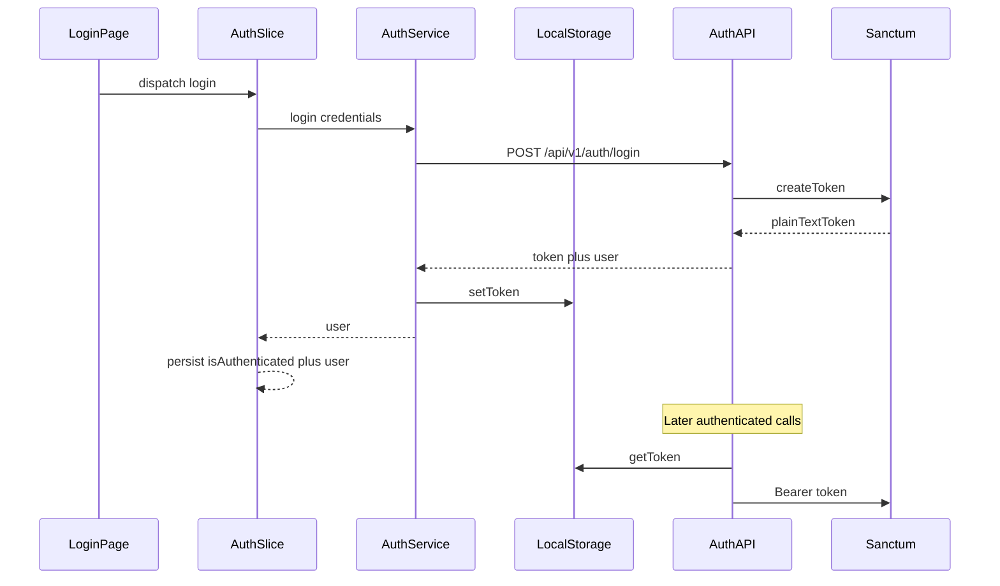

# Auth: Sanctum (BE) + Route HOCs / Persist (FE)

**Choice:** Laravel **Sanctum personal access tokens** (not a separate JWT package). The SPA stores the plain-text token and sends `Authorization: Bearer …` — same client flow people mean by “JWT-style” API auth, without tymon/jwt-auth.

## End-to-end flow



---

## Backend (Sanctum)

### Setup
- `composer require laravel/sanctum`, publish config/migration, migrate (`personal_access_tokens`).
- Add `Laravel\Sanctum\HasApiTokens` to [`backend/app/Models/User.php`](backend/app/Models/User.php).
- Ensure API uses `auth:sanctum` (token guard). No cookie SPA mode required for this Bearer flow.

### Layered auth feature (matches existing conventions)

| Layer | Files |
|-------|--------|
| Routes | [`backend/routes/api.php`](backend/routes/api.php) |
| HTTP | `AuthController`, `LoginRequest`, `UserResource`, `AuthTokenResource` (or one login resource) |
| App | `AuthService`, `LoginCredentials` DTO, `AuthSession` DTO (`token` + user) |
| Data | `UserRepositoryInterface` + `EloquentUserRepository` (`findByEmail`) |

**`AuthService`**
- `login(LoginCredentials): AuthSession` — find user, `Hash::check`, else throw a dedicated exception (e.g. `InvalidCredentialsException`) mapped to **401** in the exception handler or controller.
- On success: `$user->createToken('api')->plainTextToken`, return DTO.
- `logout(User): void` — `$user->currentAccessToken()->delete()`.
- `me(User): User` — return authenticated user.

**Routes** (`/api/v1`):

```php
Route::post('auth/login', [AuthController::class, 'login']);

Route::middleware('auth:sanctum')->group(function () {
    Route::post('auth/logout', [AuthController::class, 'logout']);
    Route::get('auth/me', [AuthController::class, 'me']);
    Route::apiResource('products', ProductController::class);
});
```

**Login JSON contract** (FE depends on this):

```json
{
  "token": "<plainTextToken>",
  "user": { "id": 1, "name": "...", "email": "..." }
}
```

**CORS:** allow the Vite origin (`http://localhost:5173`) and `Authorization` header so the SPA can call the API with Bearer tokens.

**Tests:** feature tests for login success/failure, logout, `me`, and that products return 401 without a token.

**Binding:** register `UserRepositoryInterface` in [`DomainServiceProvider`](backend/app/Providers/DomainServiceProvider.php).

---

## Frontend

### Dependencies
- `react-router-dom`
- `redux-persist`

### Local storage service
- New [`frontend/src/service/localStorageService.ts`](frontend/src/service/localStorageService.ts): `getToken`, `setToken`, `clearToken` (and only those keys). **No other file touches `localStorage` directly.**
- [`frontend/src/api/client.ts`](frontend/src/api/client.ts) request interceptor: `const token = localStorageService.getToken(); if (token) config.headers.Authorization = \`Bearer ${token}\``.
- Narrow exception to layer rules: api may import this storage helper only to attach the header (not business orchestration).

### API + service + store
- `api/responses/LoginResponse.ts`, `api/endpoints/authEndpoints.ts` — `login`, `logout`, `me`.
- `service/authService.ts` — `login`: call endpoint → `localStorageService.setToken(token)` → return mapped user; `logout`: call endpoint (best-effort) → `clearToken`; map via `mappers/authMapper.ts`.
- `store/slices/authSlice.ts` — state: `{ user, isAuthenticated, status, error }`. Token lives **only** in localStorage (API source of truth). Thunks call auth service; rejected stores error instance.
- Persist **only** the auth slice with `redux-persist` (`PersistGate` in [`main.tsx`](frontend/src/main.tsx)). On logout, clear slice + storage together.
- Rehydrate safety: if persisted `isAuthenticated` but `getToken()` is null → treat as logged out (reset auth).

### Routing + HOCs
- Add router in `App.tsx` / `view/routes`.
- [`frontend/src/view/hocs/withAuth.tsx`](frontend/src/view/hocs/withAuth.tsx) — if not authenticated after rehydrate → `<Navigate to="/login" replace />`.
- [`frontend/src/view/hocs/withGuest.tsx`](frontend/src/view/hocs/withGuest.tsx) — if authenticated → redirect to a default logged-in route (e.g. `/`).
- Wire pages: login (guest HOC), at least one protected placeholder (auth HOC) so URL guards are testable.
- Keep components off `service/` / endpoints; they only dispatch/select.

### Minimal UI (functional, not redesign)
- Simple `LoginPage` (email/password) handling `ValidationError` / `UnauthorizedError` / connection errors via `instanceof`.
- Protected home/dashboard stub so deep-linking an unauthenticated user to `/` bounces to `/login`.

---

## Out of scope
- Registration / password reset
- Role/permission matrix
- Refresh-token rotation (Sanctum PAT until revoked)
- Full product UI beyond protecting existing API routes
