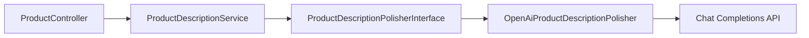

# Backend: AI generate-description API

## Contract (match FE)

- **Route:** `POST /api/v1/products/generate-description`
- **Auth:** `auth:sanctum` (place **inside** the sanctum group in [`backend/routes/api.php`](backend/routes/api.php), **before** `products/{product}` so it is not treated as an id)
- **Body:**
  ```json
  {
    "description": "string (required)",
    "product_name": "string|null (optional)",
    "category": "string|null (optional)"
  }
  ```
- **Success `200`:**
  ```json
  { "data": { "description": "polished string" } }
  ```

## Limitations (aligned with FE + API safety)

| Rule | Value |
| --- | --- |
| `description` | required string, **min 4 words**, **max 2000** chars |
| `product_name` | optional/nullable string, **max 255** |
| `category` | optional/nullable string, **max 100** |
| Output | trim; truncate to **2000** chars before return |
| OpenAI | `config('services.openai.model')` (default `gpt-4o-mini`), timeout **15s**, `temperature` **0.4**, `response_format: json_object` |
| Failures | **No silent fallback** (unlike search). OpenAI/integration errors → **502** JSON `{ "message": "..." }` |

Word rule: trim, split on whitespace, require `count >= 4` (custom FormRequest validation, same as FE `DESCRIPTION_AI_MIN_WORDS`).

## Architecture



Follow [`architecture.mdc`](.cursor/rules/architecture.mdc): Controller → Service → Integration. Do **not** call OpenAI from the controller. Leave existing [`ContentGeneratorInterface`](backend/app/Contracts/Integrations/ContentGeneratorInterface.php) / [`HttpContentGenerator`](backend/app/Infrastructure/Http/HttpContentGenerator.php) stub unused for this feature (wrong shape: title/highlights/tags).

### New classes

1. **DTO** [`app/DataTransferObjects/ProductDescriptionPolishInput.php`](backend/app/DataTransferObjects/ProductDescriptionPolishInput.php)  
   - `readonly`: `string $description`, `?string $productName`, `?string $category`

2. **Contract** [`app/Contracts/Integrations/ProductDescriptionPolisherInterface.php`](backend/app/Contracts/Integrations/ProductDescriptionPolisherInterface.php)  
   - `polish(ProductDescriptionPolishInput $input): string`  
   - `@throws IntegrationException`

3. **Adapter** [`app/Infrastructure/OpenAi/OpenAiProductDescriptionPolisher.php`](backend/app/Infrastructure/OpenAi/OpenAiProductDescriptionPolisher.php)  
   - Mirror HTTP style from [`OpenAiSearchQueryInterpreter`](backend/app/Infrastructure/OpenAi/OpenAiSearchQueryInterpreter.php): Laravel `Http`, `withToken(config('services.openai.api_key'))`, model from config  
   - System prompt: rewrite into accurate, grammatically correct travel-product marketing copy; keep meaning; do not invent facts; use optional name/category as context only; respond JSON `{"description":"..."}` only  
   - Parse `choices.0.message.content` → `description` string; throw `IntegrationException` on network/HTTP/empty/bad JSON

4. **Service** [`app/Services/ProductDescriptionService.php`](backend/app/Services/ProductDescriptionService.php)  
   - One public method `generate(ProductDescriptionPolishInput $input): string`  
   - Calls polisher; enforces output max length 2000; rethrows `IntegrationException` (no catch/fallback)

5. **FormRequest** [`app/Http/Requests/GenerateProductDescriptionRequest.php`](backend/app/Http/Requests/GenerateProductDescriptionRequest.php)  
   - Rules as in limitations table + min-words closure/rule

6. **Resource** (small) [`app/Http/Resources/GeneratedDescriptionResource.php`](backend/app/Http/Resources/GeneratedDescriptionResource.php)  
   - `{ description: string }` wrapped via `->wrap('data')` or `['data' => ...]` to match FE

### Wire-up

- [`ProductController`](backend/app/Http/Controllers/Api/V1/ProductController.php): inject `ProductDescriptionService`; add `generateDescription(GenerateProductDescriptionRequest)` — build DTO from validated input → service → resource
- [`DomainServiceProvider`](backend/app/Providers/DomainServiceProvider.php): bind `ProductDescriptionPolisherInterface` → `OpenAiProductDescriptionPolisher`
- [`bootstrap/app.php`](backend/bootstrap/app.php): render `IntegrationException` for API requests as **502** with `{ "message": "Unable to generate description. Please try again." }` (generic client message; log detail in adapter/service if useful)
- [`backend/docs/openapi.yaml`](backend/docs/openapi.yaml): document path with `security: [sanctum: []]`, 401/422/502, request/response schemas

## Tests

- **Unit** `tests/Unit/ProductDescriptionServiceTest.php`: mock polisher; assert returned string; assert truncate; assert IntegrationException propagates
- **Feature** `tests/Feature/ProductDescriptionControllerTest.php`:
  - 401 without token
  - 422 for short description / over 2000 chars
  - 200 with Sanctum user + fake polisher binding returning polished text
  - 502 when fake throws `IntegrationException`

## Out of scope

- Changing FE
- Implementing the unused `ContentGeneratorInterface` stub
- Changing product search / `OpenAiSearchQueryInterpreter`
