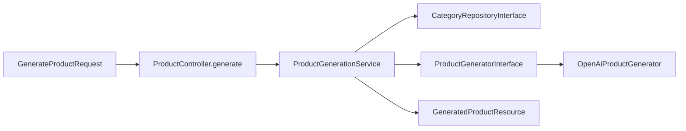

# Backend: AI product generation

Match the frontend already wired in [`productEndpoints.ts`](frontend/src/api/endpoints/productEndpoints.ts): `POST /v1/products/generate` with `{ prompt }` → `{ data: { product_name, description, category_id } }`.

Do **not** reuse or extend [`ProductDescriptionService`](backend/app/Services/ProductDescriptionService.php). Add a dedicated `ProductGenerationService`. Do **not** fill in the unused [`ContentGeneratorInterface`](backend/app/Contracts/Integrations/ContentGeneratorInterface.php) stub (wrong shape: `title` / `highlights` / `tags` / `suggestedCategory`). Delete that stub with the polish stack.

## 1. Remove “Improve with AI”

Delete the polish endpoint and unused generator stub.

**Delete files**

- [`ProductDescriptionService.php`](backend/app/Services/ProductDescriptionService.php)
- [`ProductDescriptionPolisherInterface.php`](backend/app/Contracts/Integrations/ProductDescriptionPolisherInterface.php)
- [`OpenAiProductDescriptionPolisher.php`](backend/app/Infrastructure/OpenAi/OpenAiProductDescriptionPolisher.php)
- [`ProductDescriptionPolishInput.php`](backend/app/DataTransferObjects/ProductDescriptionPolishInput.php)
- [`GenerateProductDescriptionRequest.php`](backend/app/Http/Requests/GenerateProductDescriptionRequest.php)
- [`GeneratedDescriptionResource.php`](backend/app/Http/Resources/GeneratedDescriptionResource.php)
- [`ProductDescriptionControllerTest.php`](backend/tests/Feature/ProductDescriptionControllerTest.php)
- [`ProductDescriptionServiceTest.php`](backend/tests/Unit/ProductDescriptionServiceTest.php)
- [`ContentGeneratorInterface.php`](backend/app/Contracts/Integrations/ContentGeneratorInterface.php)
- [`HttpContentGenerator.php`](backend/app/Infrastructure/Http/HttpContentGenerator.php)
- [`GeneratedContent.php`](backend/app/DataTransferObjects/GeneratedContent.php)

**Edit**

- [`routes/api.php`](backend/routes/api.php): remove `products/generate-description`
- [`ProductController`](backend/app/Http/Controllers/Api/V1/ProductController.php): drop `generateDescription`, `ProductDescriptionService` DI, related imports
- [`DomainServiceProvider`](backend/app/Providers/DomainServiceProvider.php): unbind polisher + ContentGenerator
- [`openapi.yaml`](backend/docs/openapi.yaml): remove `/products/generate-description` and schemas `GenerateProductDescriptionRequest`, `GeneratedDescription`, `GeneratedDescriptionData`

## 2. New generation stack

Follow Controller → Service → Integration/Repository ([architecture.mdc](.cursor/rules/architecture.mdc)). Mirror the OpenAI Chat Completions pattern in [`OpenAiProductDescriptionPolisher`](backend/app/Infrastructure/OpenAi/OpenAiProductDescriptionPolisher.php) / [`OpenAiSearchQueryInterpreter`](backend/app/Infrastructure/OpenAi/OpenAiSearchQueryInterpreter.php): `Http` to `https://api.openai.com/v1/chat/completions`, `response_format: json_object`, catch failures as `IntegrationException`.

| Layer | Artifact |
|---|---|
| Route | `POST products/generate` inside Sanctum group, **before** `products/{product}` |
| FormRequest | `GenerateProductRequest`: `prompt` required, string, max 2000, ≥ 4 words (same closure as the old description rule; matches FE [`productAiPromptRules.ts`](frontend/src/service/rules/productAiPromptRules.ts)) |
| Controller | `generate(GenerateProductRequest): GeneratedProductResource` — one service call |
| Service | `ProductGenerationService` |
| Contract | `ProductGeneratorInterface::generate(ProductGenerateInput): GeneratedProductData` |
| Adapter | `OpenAiProductGenerator` |
| DTOs | `ProductGenerateInput` (`prompt` + list of `{id, name}` categories); `GeneratedProductData` (`productName`, `description`, `categoryId`) |
| Resource | `GeneratedProductResource` → `{ product_name, description, category_id }` |
| Binding | `ProductGeneratorInterface` → `OpenAiProductGenerator` in DomainServiceProvider |

**Service rules**

1. Load categories via [`CategoryRepositoryInterface::allOrderedByName()`](backend/app/Contracts/Repositories/CategoryRepositoryInterface.php).
2. If the list is empty, throw `IntegrationException` (nothing valid to suggest).
3. Call the generator with prompt + allowed categories.
4. If returned `categoryId` is not in that list, throw `IntegrationException` (do not invent a fallback id).
5. Truncate `description` to 2000 chars (`mb_substr`), same as the old polish service.
6. Truncate `productName` to 255 if needed.
7. Return `GeneratedProductData`. Do **not** infer destinations, dates, price, inventory, or status.

**OpenAI system prompt** (copy generation, temperature `0.4`, timeout `15s`, same `config('services.openai.*')`):

- Output only JSON: `{ "product_name", "description", "category_id" }`
- `category_id` must be one of the provided ids (Adventure, Beach, Cultural, Food, Wellness, …)
- Description is a single string that **embeds Highlights, Inclusions, and Tags** as sections in the prose (not separate JSON keys)
- Use facts implied by the prompt; do not invent prices or unrelated amenities
- Professional travel-product tone

User message: JSON `{ prompt, categories: [{ id, name }] }`.

**502:** In [`bootstrap/app.php`](backend/bootstrap/app.php), change the IntegrationException body from `"Unable to generate description. Please try again."` to `"Unable to generate product. Please try again."` so it matches this endpoint (search still swallows integration errors).

## 3. OpenAPI (same change)

Replace the removed path with `/products/generate`:

- Auth: `sanctum`
- Request: `{ prompt }` (required, max 2000, at least 4 words)
- 200: `{ data: { product_name, description, category_id } }`
- 401 / 422 / 502

Keep schemas aligned with the FormRequest and Resource.

## 4. Tests

**Feature** `tests/Feature/ProductGenerationControllerTest.php` (bind a fake `ProductGeneratorInterface`; `RefreshDatabase`; create categories with [`CategoryFactory`](backend/database/factories/CategoryFactory.php)):

- 401 without auth
- 422 fewer than 4 words / overlong prompt
- 200 returns name, description, `category_id` from the fake
- 502 when the fake throws `IntegrationException` (assert the new message)

**Unit** `tests/Unit/ProductGenerationServiceTest.php` (mock generator + category repo, no HTTP/DB):

- passes allowed categories into the generator
- truncates overlong description
- throws when `category_id` is not in the loaded list
- propagates `IntegrationException`

Do not call the real OpenAI API in tests.
