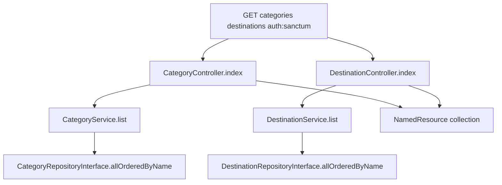

# Backend: category and destination list APIs

**Scope:** Backend only. List endpoints for product form lookups. No create/update/delete for these resources.

**FE contract already expected:**

| Method | Path | Auth | Response |
|--------|------|------|----------|
| `GET` | `/api/v1/categories` | `auth:sanctum` | `{ "data": [{ "id", "name" }] }` |
| `GET` | `/api/v1/destinations` | `auth:sanctum` | `{ "data": [{ "id", "name" }] }` |

Models already exist: [`Category`](backend/app/Models/Category.php), [`Destination`](backend/app/Models/Destination.php) (`id`, `name`, soft deletes). Soft-deleted rows are excluded by Eloquent by default.

## Layer flow



### Routes — [`backend/routes/api.php`](backend/routes/api.php)

Inside the existing `auth:sanctum` group:

```php
Route::get('categories', [CategoryController::class, 'index']);
Route::get('destinations', [DestinationController::class, 'index']);
```

### Shared resource

One reusable resource for both (same shape):

- [`backend/app/Http/Resources/NamedResource.php`](backend/app/Http/Resources/NamedResource.php) — `id`, `name`
- Controllers return `NamedResource::collection($items)` → FE `{ data: [...] }`

### Category stack

| Layer | File |
|-------|------|
| Controller | `Http/Controllers/Api/V1/CategoryController.php` — call service, return collection |
| Service | `Services/CategoryService.php` — `list(): Collection` |
| Contract | `Contracts/Repositories/CategoryRepositoryInterface.php` — `allOrderedByName(): Collection` |
| Repo | `Repositories/Eloquent/EloquentCategoryRepository.php` — `Category::query()->orderBy('name')->get()` |
| Binding | register in [`DomainServiceProvider`](backend/app/Providers/DomainServiceProvider.php) |

### Destination stack

Same pattern:

- `DestinationController`, `DestinationService`
- `DestinationRepositoryInterface`, `EloquentDestinationRepository`
- Bind in `DomainServiceProvider`

No FormRequest (no query filters for this pass). Controllers stay thin: one service call, one resource return.

### Seeders

Add lookup data so create/edit forms work locally:

- `database/seeders/CategorySeeder.php` — e.g. Adventure, Beach, Cultural, Food, Wellness (idempotent `updateOrCreate` by name)
- `database/seeders/DestinationSeeder.php` — e.g. Colombo, Kandy, Galle, Ella, Sigiriya
- Call both from [`DatabaseSeeder`](backend/database/seeders/DatabaseSeeder.php) alongside the test user

### Tests

**Feature:**

- Unauthenticated `GET /api/v1/categories` and `/destinations` → 401
- Authenticated lists return seeded/factory rows as `{ data: [{ id, name }] }`, ordered by name
- Soft-deleted category/destination does not appear

**Unit (optional but keep parity with products):** service forwards to repository `allOrderedByName`.

## Out of scope

- Category/Destination CRUD beyond list
- Pagination/search/filters
- Frontend changes (hooks/endpoints already exist)
- Nesting under products routes
