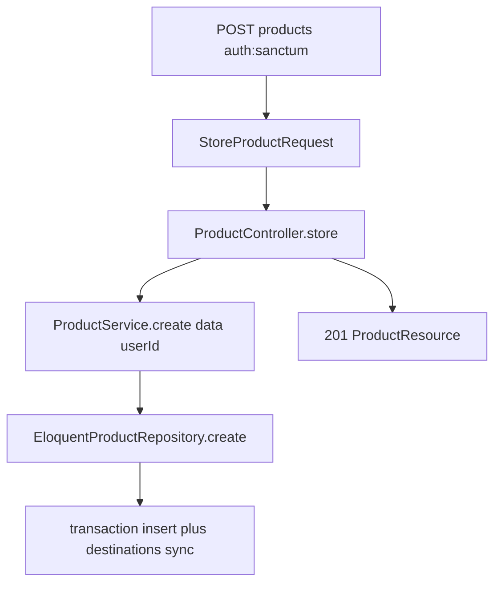

# Backend: create product API

**Scope:** Backend only. No FE work.

**Contract** (matches FE [`CreateProductPayload`](frontend/src/types/ProductFormValues.ts) and existing update body):

| Method | Path | Auth | Success |
|--------|------|------|---------|
| `POST` | `/api/v1/products` | `auth:sanctum` | `201` + `ProductResource` |

```json
{
  "product_name": "string",
  "category_id": 1,
  "description": "string",
  "price": 100.00,
  "inventory_count": 10,
  "valid_from": "2026-01-01",
  "valid_until": "2026-12-31",
  "status": "Active",
  "destination_ids": [1, 2]
}
```

**Ownership:** `user_id` is set from `$request->user()->id` only. Client cannot set owner.

## Layer flow



### Routes — [`backend/routes/api.php`](backend/routes/api.php)

Inside `auth:sanctum`, add:

```php
Route::post('products', [ProductController::class, 'store']);
```

Keep existing GET/PUT/DELETE product routes.

### FormRequest — [`StoreProductRequest`](backend/app/Http/Requests/StoreProductRequest.php)

Mirror [`UpdateProductRequest`](backend/app/Http/Requests/UpdateProductRequest.php) rules exactly:

- `product_name` — required, string, max:255
- `category_id` — required, integer, `exists:categories,id`
- `description` — required, string
- `price` — required, numeric, min:0
- `inventory_count` — required, integer, min:0
- `valid_from` — required, date
- `valid_until` — required, date, `after_or_equal:valid_from`
- `status` — required, `Rule::enum(ProductStatus::class)`
- `destination_ids` — required, array, min:1
- `destination_ids.*` — integer, `exists:destinations,id`

`authorize(): true`.

To avoid rule drift, extract shared rules into a small trait (e.g. `ValidatesProductWrite`) used by both Store and Update requests.

### Controller — [`ProductController::store`](backend/app/Http/Controllers/Api/V1/ProductController.php)

Same `ProductData` mapping pattern as `update` (Carbon dates, `ProductStatus::from`, destination id cast).

```php
$product = $this->products->create($data, $request->user()->id);

return (new ProductResource($product->load(['category', 'destinations'])))
    ->response()
    ->setStatusCode(201);
```

### Service — [`ProductService::create`](backend/app/Services/ProductService.php)

Change signature (mirror update’s `userId` arg):

```php
public function create(ProductData $data, int $userId): Product
{
    return $this->products->create($data, $userId);
}
```

### Repository — interface + Eloquent

Update [`ProductRepositoryInterface::create`](backend/app/Contracts/Repositories/ProductRepositoryInterface.php) to `create(ProductData $data, int $userId): Product`.

Implement [`EloquentProductRepository::create`](backend/app/Repositories/Eloquent/EloquentProductRepository.php) inside `DB::transaction`:

1. `Product::query()->create([...fields from DTO..., 'user_id' => $userId])`
2. `$product->destinations()->sync($data->destinationIds)`
3. Return `$product->refresh()`

Never accept `user_id` from the request body.

### ProductResource

Already includes `description` and relation shapes used by FE — no change required unless tests need it.

## Tests

**Feature** ([`ProductControllerTest`](backend/tests/Feature/ProductControllerTest.php)):

- Unauthenticated POST → 401
- Authenticated valid payload → 201, JSON has product fields + category + destinations; DB row has `user_id` = auth user; pivot rows for destinations
- Validation failure (empty / bad dates / empty destinations) → 422
- Cannot assign another user’s id via body (ignore/absent field; product still owned by auth user)

**Unit** ([`ProductServiceTest`](backend/tests/Unit/ProductServiceTest.php)):

- `create` forwards `ProductData` + `userId` to `repository->create`

Reuse Category/Destination/Product factories and seeders.

## Out of scope

- Frontend create page (already wired to `POST /v1/products`)
- Show (`GET /products/{id}`) unless needed later for edit
- AI generation fields
- Changing owner after create
