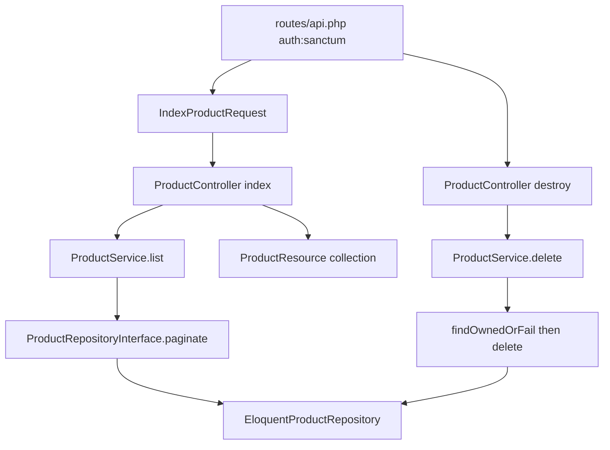

# Backend: owner product list + delete

**Scope:** Only two authenticated product endpoints — list and delete. No create/update/show in this work.

**Current state:** Layers are largely already written ([`ProductController`](backend/app/Http/Controllers/Api/V1/ProductController.php), [`ProductService`](backend/app/Services/ProductService.php), [`EloquentProductRepository`](backend/app/Repositories/Eloquent/EloquentProductRepository.php), [`ProductResource`](backend/app/Http/Resources/ProductResource.php), [`IndexProductRequest`](backend/app/Http/Requests/IndexProductRequest.php)). This plan **finishes and hardens** that stack rather than rewriting it.

## Endpoints

| Method | Path | Auth | Behavior |
|--------|------|------|----------|
| `GET` | `/api/v1/products?page=&per_page=` | `auth:sanctum` | Paginate **current user’s Active** products |
| `DELETE` | `/api/v1/products/{product}` | `auth:sanctum` | Soft-delete if owned; else **404** |

**Ownership rule:** `userId` always comes from `$request->user()->id`. Client cannot pass another user’s id. Inactive and other users’ products never appear in index.

## Layer flow



### Routes ([`backend/routes/api.php`](backend/routes/api.php))
Replace full `apiResource` with only:

```php
Route::get('products', [ProductController::class, 'index']);
Route::delete('products/{product}', [ProductController::class, 'destroy']);
```

Leave `store` / `show` / `update` stubs unused (or keep throwing until a later feature).

### Presentation
- **Index:** keep building `ProductSearchCriteria` with `userId` = auth id, `status` = `Active`, `onlyValid: false`, `page` / `perPage` from validated input; return `ProductResource::collection($paginator)`.
- **Destroy:** inject `Request` (or use route-model-free int id as today); call `$this->products->delete($product, $request->user()->id)`; return `204`. Stop using the awkward `request()` helper assignment.
- **IndexProductRequest:** keep `page` / `per_page` rules only (no `user_id` / `status` from client).
- **ProductResource:** keep FE-aligned fields (`product_name`, `price`, `inventory_count`, dates, `status`, nested `category` / `destinations`).

### Application
- `ProductService::list` → repository `paginate` (already).
- `ProductService::delete(int $id, int $userId)` → `findOwnedOrFail` then `delete` (already). ModelNotFoundException → Laravel 404.

### Data access
- Keep owner + status filters and eager-loads in `EloquentProductRepository::paginate`.
- Implement [`Product::valid`](backend/app/Models/Product.php) scope (`valid_from <= today` and `valid_until >= today`) so `onlyValid: true` is safe if reused later; manage list keeps `onlyValid: false`.
- Soft delete via `$product->delete()` (already).

### Wiring
- Confirm [`DomainServiceProvider`](backend/app/Providers/DomainServiceProvider.php) still binds `ProductRepositoryInterface` → `EloquentProductRepository` (already present).

## Tests

**Feature** ([`ProductControllerTest`](backend/tests/Feature/ProductControllerTest.php)):
- Unauthenticated list/delete → 401
- Index returns only auth user’s Active products (excludes other users + Inactive)
- Pagination meta (`current_page`, `last_page`, `per_page`, `total`) present
- Delete owned → 204 + soft-deleted
- Delete another user’s id → 404

Add minimal factories (`Category`, `Destination`, `Product` with `HasFactory`) so tests can seed rows.

**Unit** ([`ProductServiceTest`](backend/tests/Unit/ProductServiceTest.php)): fake `ProductRepositoryInterface`; assert `list` forwards criteria; `delete` calls `findOwnedOrFail` then `delete`.

## Out of scope
- Create / update / show product APIs
- AI generation, search, public catalog
- Frontend changes
