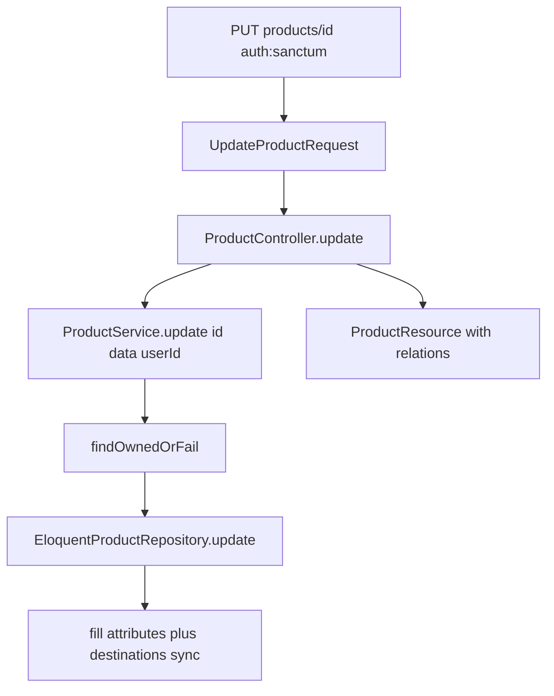

# Backend: update product API

**Scope:** Backend only. Add owner-scoped product update. No FE work.

**Contract** (aligned with FE [`CreateProductPayload`](frontend/src/types/ProductFormValues.ts)):

| Method | Path | Auth | Success |
|--------|------|------|---------|
| `PUT` | `/api/v1/products/{product}` | `auth:sanctum` | `200` + `ProductResource` |

**Body (snake_case, all required for full replace):**

```json
{
  "product_name": "string",
  "category_id": 1,
  "description": "string",
  "price": 100.00,
  "inventory_count": 10,
  "valid_from": "2026-01-01",
  "valid_until": "2026-12-31",
  "status": "Active",
  "destination_ids": [1, 2]
}
```

**Ownership:** Resolve via `findOwnedOrFail($id, $request->user()->id)` (same as delete). Wrong owner / missing → **404**. Client cannot change `user_id`.

## Layer flow



### Routes — [`backend/routes/api.php`](backend/routes/api.php)

Keep existing `GET` / `DELETE`. Add:

```php
Route::put('products/{product}', [ProductController::class, 'update']);
```

(`PATCH` not required; full replace via `PUT`.)

### FormRequest — [`UpdateProductRequest`](backend/app/Http/Requests/UpdateProductRequest.php)

- `authorize(): true` (ownership enforced in service)
- Rules:
  - `product_name` — required, string, max:255
  - `category_id` — required, integer, `exists:categories,id`
  - `description` — required, string
  - `price` — required, numeric, min:0
  - `inventory_count` — required, integer, min:0
  - `valid_from` — required, date
  - `valid_until` — required, date, `after_or_equal:valid_from`
  - `status` — required, `Rule::enum(ProductStatus::class)`
  - `destination_ids` — required, array, min:1
  - `destination_ids.*` — integer, `exists:destinations,id`

### Controller — [`ProductController::update`](backend/app/Http/Controllers/Api/V1/ProductController.php)

- Build [`ProductData`](backend/app/DataTransferObjects/ProductData.php) from validated input (`Carbon::parse` for dates, `ProductStatus` for status).
- Call `$this->products->update($product, $data, $request->user()->id)`.
- Return `new ProductResource($updated->load(['category', 'destinations']))`.

### Service — [`ProductService::update`](backend/app/Services/ProductService.php)

Change signature to ownership-aware (mirror delete):

```php
public function update(int $id, ProductData $data, int $userId): Product
{
    $product = $this->products->findOwnedOrFail($id, $userId);
    return $this->products->update($product, $data);
}
```

### Repository — [`EloquentProductRepository::update`](backend/app/Repositories/Eloquent/EloquentProductRepository.php)

Inside `DB::transaction`:

1. Fill/update: `product_name`, `category_id`, `description`, `price`, `inventory_count`, `valid_from`, `valid_until`, `status` from DTO (never touch `user_id`).
2. `$product->destinations()->sync($data->destinationIds)`.
3. Return fresh model (or same instance after refresh).

### ProductResource

Add `description` to [`ProductResource`](backend/app/Http/Resources/ProductResource.php) so update (and later edit/show) can round-trip the form field. Existing list clients ignore extra keys.

## Tests

**Feature** ([`ProductControllerTest`](backend/tests/Feature/ProductControllerTest.php)):

- Unauthenticated PUT → 401
- Owner updates fields + destinations → 200, JSON asserts updated values / category / destinations
- Validation failure (empty body / bad dates / missing destinations) → 422
- Other user’s product id → 404
- Product still owned by original `user_id` after update

**Unit** ([`ProductServiceTest`](backend/tests/Unit/ProductServiceTest.php)):

- `update` calls `findOwnedOrFail` then `repository->update` with the DTO

Reuse existing Product/Category/Destination factories from list/delete work.

## Out of scope

- Frontend edit form / mutation
- Create (`POST`) / show (`GET by id`)
- Partial PATCH / field-level authorization
- Changing product owner
