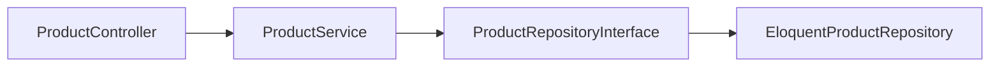

# Backend: Product summary API + 100-product seeder

## Part A — Product summary endpoint

Match the FE contract already wired in [`productEndpoints.ts`](frontend/src/api/endpoints/productEndpoints.ts):

- **Route:** `GET /api/v1/products/summary`
- **Auth:** `auth:sanctum`
- **Response:**
  ```json
  {
    "data": {
      "total_products": 12,
      "active_products": 8,
      "expired_products": 3
    }
  }
  ```

**Count rules** (owned by authenticated user, non–soft-deleted):

| Field | Meaning |
| --- | --- |
| `total_products` | All owned products |
| `active_products` | `status = Active` |
| `expired_products` | `valid_until < today` (reuse model `expired()` scope) |

Active and expired can overlap (Active + past end date); that is intentional and matches the FE labels.

### Implementation (layered)



1. **Repository** — add `summarizeForUser(int $userId): array` (or a small readonly DTO) on [`ProductRepositoryInterface`](backend/app/Contracts/Repositories/ProductRepositoryInterface.php) / [`EloquentProductRepository`](backend/app/Repositories/Eloquent/EloquentProductRepository.php): one query with conditional aggregates (`COUNT(*)`, `SUM(status = Active)`, `SUM(valid_until < today)`).
2. **Service** — [`ProductService`](backend/app/Services/ProductService.php) method `summary(int $userId)` calling the repo.
3. **Resource** — `ProductSummaryResource` wrapping the three snake_case fields under `data`.
4. **Controller** — [`ProductController::summary`](backend/app/Http/Controllers/Api/V1/ProductController.php) using `$request->user()->id`.
5. **Route** — in [`routes/api.php`](backend/routes/api.php) inside sanctum, **before** `products/{product}`:
   `Route::get('products/summary', ...)`.
6. **OpenAPI** — document in [`backend/docs/openapi.yaml`](backend/docs/openapi.yaml) with sanctum + 401.
7. **Tests** — feature: 401 without auth; 200 with seeded owned products asserting the three counts (include Active+expired and Inactive cases).

## Part B — ProductSeeder (100 products)

No product seeder exists today ([`DatabaseSeeder`](backend/database/seeders/DatabaseSeeder.php) only creates `test@test.com`, categories, destinations).

### Goals

- Seed **100** products owned by `test@test.com`.
- Use **seeded** categories (`Adventure`, `Beach`, `Cultural`, `Food`, `Wellness`) and destinations (`Colombo`, `Kandy`, `Galle`, `Ella`, `Sigiriya`) — not random factories for category/destination.
- Mix statuses/validity so summary tiles are non-trivial (~70 Active+valid, ~15 expired, ~15 Inactive).
- Price range roughly **2,000–50,000 LKR** with many **below 10,000** for “below LKR 10,000” search.
- Phrase `product_name` / `description` so OpenAI keyword/category/destination filters hit reliably.

### Theme clusters (illustrative distribution ≈100)

| Theme | Category | Destination | Name/description cues | Count |
| --- | --- | --- | --- | --- |
| Dinner / lunch buffets | Food | Colombo | “Dinner Buffet”, “Cinnamon Grand”, “Hilton Colombo” | ~15 |
| Airport transfers | Adventure or Cultural | Colombo | “Airport transfer”, “CMB pickup”, “private transfer” | ~10 |
| Family packages | Cultural / Beach | Colombo, Kandy, Galle | “Family package”, “kids”, multi-day | ~12 |
| Adventure | Adventure | Ella, Sigiriya | hiking, climb | ~12 |
| Beach | Beach | Galle | beach day, coastal | ~12 |
| Cultural | Cultural | Kandy | temple, heritage | ~12 |
| Wellness | Wellness | mixed | spa, retreat | ~10 |
| Price / status fillers | mixed | mixed | mix &lt;10k and ≥10k; expired + Inactive | ~17 |

Include at least one explicit product like **“Dinner Buffet at Cinnamon Grand Colombo”** with `valid_until` end of current month so demos match the user’s sample queries.

### Wiring

- New [`backend/database/seeders/ProductSeeder.php`](backend/database/seeders/ProductSeeder.php): resolve user/categories/destinations by name; create products in loops/arrays; attach destination pivots.
- Call it from `DatabaseSeeder` after Category + Destination seeders.
- Prefer idempotent-friendly approach: delete existing products for the test user before insert, or `Product::query()->where('user_id', ...)->delete()` so re-seed stays at 100.

### Factory

Leave [`ProductFactory`](backend/database/factories/ProductFactory.php) for tests; seeder uses explicit attributes (or factory + `->state([...])` overrides) so NL phrases stay stable.

## Out of scope

- Frontend changes (already done)
- Changing search OpenAI prompts or forcing status via AI
- Adding new categories (e.g. Transfer / Dining) — use keyword + existing `Food` / destinations instead
