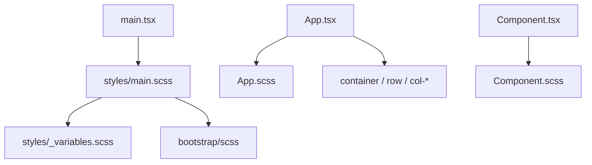

# Integrate Bootstrap + SCSS into Frontend

## Context

The frontend is a Vite + React + TypeScript app ([frontend/package.json](frontend/package.json)) with default starter CSS only. Entry point: [frontend/src/main.tsx](frontend/src/main.tsx).

**Approach:**

- Install **Bootstrap** + **sass** (Vite compiles SCSS natively once `sass` is present)
- Import Bootstrap via **SCSS** (not the minified CSS) so app variables and nesting work cleanly
- Use Bootstrap **`container` / `row` / `col-*`** as the standard layout pattern
- Keep a **co-located `.scss` file per component** that needs custom styles, plus shared variables

## Folder structure

```
frontend/src/
  styles/
    _variables.scss    # shared SCSS + CSS custom properties
    main.scss          # Bootstrap import + global base
  App.tsx
  App.scss             # App-only styles (nested blocks)
  components/          # future components
    Example/
      Example.tsx
      Example.scss     # one style file per component that needs it
```

## Steps

### 1. Install dependencies

From `frontend/`:

```bash
npm install bootstrap
npm install -D sass
```

### 2. Shared variables + global SCSS entry

Create [frontend/src/styles/_variables.scss](frontend/src/styles/_variables.scss) for app theme tokens (SCSS vars and/or CSS custom properties), e.g. brand colors, spacing overrides.

Create [frontend/src/styles/main.scss](frontend/src/styles/main.scss):

1. Load Bootstrap functions/variables
2. Optionally override Bootstrap SCSS variables before the full import
3. Import Bootstrap
4. Apply minimal global base (body/`#root` only — no Vite starter layout)

Pattern:

```scss
@use 'variables' as *;

@import 'bootstrap/scss/functions';
@import 'bootstrap/scss/variables';
// Bootstrap variable overrides go here if needed
@import 'bootstrap/scss/maps';
@import 'bootstrap/scss/mixins';
@import 'bootstrap/scss/root';
@import 'bootstrap/scss/reboot';
@import 'bootstrap/scss/containers';
@import 'bootstrap/scss/grid';
@import 'bootstrap/scss/utilities';
@import 'bootstrap/scss/buttons';
// add more Bootstrap partials as features need them
```

Start with the full `@import 'bootstrap/scss/bootstrap';` for simplicity on day one; split to partials later if bundle size matters.

### 3. Wire entry and remove starter CSS conflict

In [frontend/src/main.tsx](frontend/src/main.tsx):

```tsx
import './styles/main.scss'
import App from './App.tsx'
```

- Delete or stop using [frontend/src/index.css](frontend/src/index.css) and the old Vite-heavy [frontend/src/App.css](frontend/src/App.css)
- Do not keep `#root { width: 1126px; ... }` — it fights Bootstrap’s fluid grid

### 4. Bootstrap row/column layout + per-component SCSS

Restyle [frontend/src/App.tsx](frontend/src/App.tsx) using Bootstrap grid as the shell:

```tsx
import './App.scss'

function App() {
  return (
    <div className="app container py-4">
      <div className="row">
        <div className="col-12 col-md-8">
          <h1>Travel Product Management</h1>
        </div>
        <div className="col-12 col-md-4">
          <button type="button" className="btn btn-primary">Get started</button>
        </div>
      </div>
    </div>
  )
}
```

Create [frontend/src/App.scss](frontend/src/App.scss) with nested SCSS for App-only tweaks:

```scss
@use './styles/variables' as *;

.app {
  h1 {
    color: $text-heading;
  }

  .btn-primary {
    // component-level override if needed
  }
}
```

**Convention going forward:** for each component that needs custom styles, add a sibling `.scss` file and import it from the `.tsx` file. Prefer Bootstrap utilities/grid first; use SCSS only for theme tokens and component-specific nesting.

### 5. Verify

- `npm run dev` — confirm grid + Bootstrap button styles
- `npm run build` — confirm Sass + Bootstrap SCSS compile

## Out of scope

- **react-bootstrap** — CSS/SCSS + classNames only for now
- **Bootstrap JS** — add later for modals/dropdowns if needed
- Building out the full travel UI — this plan only sets the styling foundation

## Result



Layout uses Bootstrap’s grid; theming and nested rules live in SCSS; each component that needs custom look gets its own style file.
