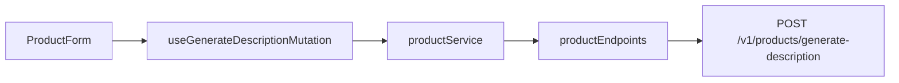

# Frontend: AI description polish on Create product

## Scope

Frontend only. Wire against this **assumed** backend contract (endpoint does not exist yet; BE work is out of scope):

- **Method/path:** `POST /api/v1/products/generate-description` (auth: Sanctum, same as create)
- **Request body:**
  ```json
  {
    "description": "string (required)",
    "product_name": "string|null (optional)",
    "category": "string|null (optional category name)"
  }
  ```
- **Success response:**
  ```json
  { "data": { "description": "polished string" } }
  ```

Default UX placement: shared [`ProductForm.tsx`](frontend/src/view/components/products/ProductForm.tsx) so **Create and Edit** both get the control (same description field).

## Character / word limits (decided)

| Rule | Value | Why |
| --- | --- | --- |
| Enable AI icon | **> 3 words** (≥ 4 whitespace-separated tokens after trim) | Matches your requirement |
| Max description length (textarea + AI request) | **2000 characters** | Enough for a travel product blurb; keeps prompts bounded |
| On AI click if over limit | Do not call API; show inline field error | Fail closed on FE |

Word count helper: trim, split on `/\s+/`, ignore empty tokens. Enforce `maxLength={2000}` on the textarea and truncate/reject AI payload over 2000.

## Architecture (follow existing layers)



### 1. API layer

- Add types in [`frontend/src/api/responses/`](frontend/src/api/responses/) e.g. `generateDescriptionResponse.ts`: `{ data: { description: string } }`
- Add `generateProductDescription(payload)` in [`frontend/src/api/endpoints/productEndpoints.ts`](frontend/src/api/endpoints/productEndpoints.ts) — try/catch + `mapAxiosError`

### 2. Service layer

- Add `generateProductDescription` in [`frontend/src/service/productService.ts`](frontend/src/service/productService.ts): map response → `{ description: string }`
- Add pure helpers in [`frontend/src/service/rules/`](frontend/src/service/rules/) e.g. `descriptionAiRules.ts`:
  - `countWords(text)`
  - `canUseDescriptionAi(text)` → word count > 3 and length ≤ 2000
  - `DESCRIPTION_MAX_LENGTH = 2000`

### 3. View hook

- New [`frontend/src/view/hooks/useGenerateDescriptionMutation.ts`](frontend/src/view/hooks/useGenerateDescriptionMutation.ts) — `useMutation` calling the service (same pattern as [`useCreateProductMutation.ts`](frontend/src/view/hooks/useCreateProductMutation.ts))

### 4. UI in ProductForm

In [`ProductForm.tsx`](frontend/src/view/components/products/ProductForm.tsx), under the description textarea:

- Small AI sparkle **icon button** (reuse the SVG path from [`ProductSearchBar.tsx`](frontend/src/view/components/products/ProductSearchBar.tsx); extract a tiny shared `AiSparkleIcon` under `view/components/ui/` to avoid duplication)
- Visible / enabled only when `canUseDescriptionAi(values.description)` and not busy
- Hidden or disabled (with `title`/`aria` explaining “Enter at least 4 words”) when under the word threshold
- On click:
  - Payload: `{ description: trimmed, product_name: trimmed name or omit/null, category: selected category name or omit/null }`
  - On success: `dispatch({ type: 'setField', field: 'description', value: result.description })`
  - On error: map `ValidationError` / connection / unexpected to a short message under the description field (or a small AI-specific error line)
- While generating: disable textarea + AI button; show subtle pending state (e.g. button `aria-busy`, spinner or “Improving…”)
- Re-click allowed after success (regenerate with current description text)
- Disable AI while form `busy` (create/save in flight)

Styles: co-located tweaks in [`ProductForm.scss`](frontend/src/view/components/products/ProductForm.scss) — compact icon button under the field, aligned start, Bootstrap utilities first.

Optional: char counter `n / 2000` near the AI control for clarity.

### 5. CreateProductPage

No structural change required beyond shared form; page keeps submit flow. Ensure generate pending does not block navigation incorrectly (local mutation state stays in ProductForm).

## Files to touch

| File | Change |
| --- | --- |
| `frontend/src/api/responses/generateDescriptionResponse.ts` | New response type |
| `frontend/src/api/endpoints/productEndpoints.ts` | New POST endpoint |
| `frontend/src/service/productService.ts` | New service fn |
| `frontend/src/service/rules/descriptionAiRules.ts` | Word/char rules |
| `frontend/src/view/hooks/useGenerateDescriptionMutation.ts` | Mutation hook |
| `frontend/src/view/components/ui/AiSparkleIcon.tsx` | Shared icon |
| `frontend/src/view/components/products/ProductForm.tsx` | AI button + wiring |
| `frontend/src/view/components/products/ProductForm.scss` | Icon button layout |
| `frontend/src/view/components/products/ProductSearchBar.tsx` | Switch to shared icon |

## Out of scope

- Backend route / OpenAI prompt implementation
- Changing product create/update payload validation beyond FE maxLength
