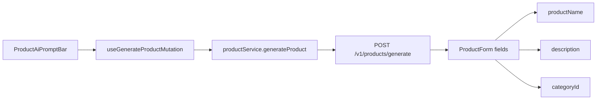

# Frontend: AI product generation on create form

## What this changes

On **Create product** only, users describe a product in natural language (e.g. “Create a Dinner Buffet at Cinnamon Grand Colombo available until the end of this month.”). Hitting the sparkle icon generates **name**, **description**, and **category**, then fills those three fields. The rest of the form stays manual. The user can edit anything afterward.

Highlights, inclusions, and tags are **not** new form fields. They belong inside the generated **description** text (backend prompt responsibility). The existing description textarea already stores that as one string.

Edit product is unchanged (no prompt bar).



## Backend contract (FE prerequisite)

The frontend cannot call OpenAI directly ([frontend-architecture](.cursor/rules/frontend-architecture.mdc): only `api/` talks to the network). Today [`POST /v1/products/generate-description`](frontend/src/api/endpoints/productEndpoints.ts) only polishes an existing description. This feature needs a **new** authenticated endpoint (backend work is out of this plan, but FE will wire to this shape):

- **Method/path:** `POST /v1/products/generate`
- **Auth:** Sanctum (same as create)
- **Request:** `{ "prompt": "Create a Dinner Buffet at Cinnamon Grand Colombo..." }`
- **Success 200:**

```json
{
  "data": {
    "product_name": "Dinner Buffet at Cinnamon Grand Colombo",
    "description": "Full prose including Highlights, Inclusions, and Tags sections.",
    "category_id": 4
  }
}
```

- **Category:** backend must pick from existing categories (Adventure, Beach, Cultural, Food, Wellness, …). FE maps `category_id` onto the already-loaded `<select>`.
- **Description:** single string; embed Highlights / Inclusions / Tags in the prose. Truncate to 2000 chars on the client if needed.
- **Errors:** `422` prompt validation, `401` session, `502` model failure (same pattern as generate-description).

Do **not** fill destinations, dates, price, inventory, or status even if the prompt mentions them.

## 1. Remove “Improve with AI”

Delete the description-polish UI and its dedicated FE stack:

- In [`ProductForm.tsx`](frontend/src/view/components/products/ProductForm.tsx): remove the button under the textarea, `handleImproveDescription`, `useGenerateDescriptionMutation`, and `aiEnabled` tied to description text. Keep the character counter.
- Delete [`useGenerateDescriptionMutation.ts`](frontend/src/view/hooks/useGenerateDescriptionMutation.ts)
- Remove `generateProductDescription` from [`productService.ts`](frontend/src/service/productService.ts) and [`productEndpoints.ts`](frontend/src/api/endpoints/productEndpoints.ts)
- Delete [`generateDescriptionResponse.ts`](frontend/src/api/responses/generateDescriptionResponse.ts)
- Replace [`descriptionAiRules.ts`](frontend/src/service/rules/descriptionAiRules.ts): drop `canUseDescriptionAi`. Keep `DESCRIPTION_MAX_LENGTH` (textarea `maxLength` + counter). Move prompt enable rules into a new `productAiPromptRules.ts`.

Keep `.product-form__ai-btn` styles only if the new prompt bar still needs them; otherwise remove.

## 2. API / service / hook (view → service → api)

Follow the existing generate-description layering:

| Layer | File | Role |
|---|---|---|
| Response type | `frontend/src/api/responses/generateProductResponse.ts` | `{ data: { product_name, description, category_id } }` |
| Endpoint | [`productEndpoints.ts`](frontend/src/api/endpoints/productEndpoints.ts) | `generateProduct({ prompt })` → `POST /v1/products/generate` |
| Domain type | `frontend/src/types/GeneratedProduct.ts` | `{ productName, description, categoryId }` |
| Mapper | `frontend/src/service/mappers/generatedProductMapper.ts` | snake_case → domain |
| Service | [`productService.ts`](frontend/src/service/productService.ts) | `generateProduct(prompt)` |
| Rules | `frontend/src/service/rules/productAiPromptRules.ts` | min words (reuse 4-word rule), max prompt length |
| Hook | `frontend/src/view/hooks/useGenerateProductMutation.ts` | TanStack `useMutation` → service |

Service maps `category_id` to a string for the form select (`String(categoryId)`), matching how [`ProductForm`](frontend/src/view/components/products/ProductForm.tsx) stores `categoryId`.

## 3. Prompt bar UI (create form only)

Add a presentational [`ProductAiPromptBar`](frontend/src/view/components/products/ProductAiPromptBar.tsx) modeled on [`ProductSearchBar`](frontend/src/view/components/products/ProductSearchBar.tsx): Bootstrap `input-group`, text input, sparkle [`AiSparkleIcon`](frontend/src/view/components/ui/AiSparkleIcon.tsx) as the action button.

Important: this sits **inside** `ProductForm`, so it must **not** be a nested `<form>`. Use `type="button"` on the icon. Intercept Enter in the input (`preventDefault`) so it generates instead of submitting the product.

Place it **above Product name** in [`ProductForm.tsx`](frontend/src/view/components/products/ProductForm.tsx), gated by `showAiPrompt?: boolean`.

- [`CreateProductPage.tsx`](frontend/src/view/pages/CreateProductPage.tsx) passes `showAiPrompt`
- [`ProductEditPage.tsx`](frontend/src/view/pages/ProductEditPage.tsx) does not

Suggested copy:

- Label: “Describe the product”
- Placeholder: “e.g. Create a Dinner Buffet at Cinnamon Grand Colombo available until the end of this month.”
- Helper: “AI will fill name, description, and category. You can edit them after.”
- Button `aria-label` / title: “Generate product with AI”
- Busy: disable input + icon, `aria-busy`, maybe a short “Generating…” hint

Enable the icon when the prompt has at least 4 words and the form is not busy/generating (same word-count idea as the old description AI).

Co-located SCSS: [`ProductAiPromptBar.scss`](frontend/src/view/components/products/ProductAiPromptBar.scss) — reuse search-bar sizing (`min-height` / centered icon). Bootstrap `input-group` + utilities first.

## 4. Fill the form, keep it editable

On success, patch only the three generated fields via the existing reducer [`setField`](frontend/src/view/hooks/useProductFormReducer.ts) (or a small `patchFields` action). Leave destinations, price, inventory, dates, and status untouched.

- `productName` ← generated name
- `description` ← generated description (slice to `DESCRIPTION_MAX_LENGTH`)
- `categoryId` ← `String(category_id)` **only if** that id exists in the `categories` prop; otherwise leave the select empty and show a short AI error (“Could not match a category. Please choose one.”)

Overwrite those three fields with no confirm (create flow is typically empty). User can still change any field before submit. Existing [`validateProductForm`](frontend/src/service/rules/productFormRules.ts) still runs on submit.

While generating: disable the rest of the form (same as current `fieldsDisabled = busy \|\| generating`).

Errors (local prompt rules + `ValidationError` / `UnauthorizedError` / `ConnectionError` / fallback) render under the prompt bar, same pattern as the old `aiError` under description.

## 5. Out of scope

- Backend OpenAI adapter, route, tests, OpenAPI (needed before this UI works end-to-end)
- New Highlights / Inclusions / Tags inputs
- Inferring destination or `validUntil` from the prompt
- Showing the prompt bar on edit
- Calling OpenAI from the browser
