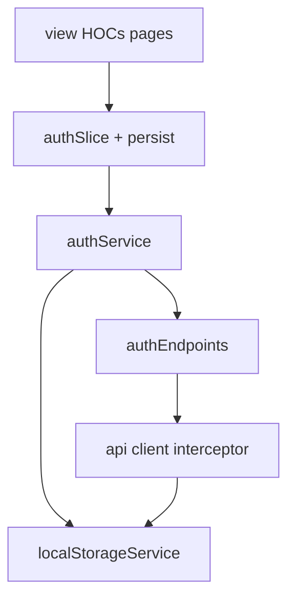

# FE auth routing and token persistence

## Scope

Frontend only. No backend auth work. Login endpoint will call `POST /v1/auth/login` and expect:

```ts
{ token: string; user: { id: number; name: string; email: string } }
```

## Dependency direction



`localStorageService` is shared infrastructure used by **auth service** (write/clear on login/logout) and **api client** (read on authenticated requests). It does not import axios or the store.

## Packages

Add to [frontend/package.json](frontend/package.json):

- `react-router-dom`
- `redux-persist`

## 1. LocalStorage service

Create [frontend/src/service/localStorageService.ts](frontend/src/service/localStorageService.ts):

- Key constant e.g. `auth_token`
- `getToken()`, `setToken(token)`, `clearToken()`
- Thin wrappers only; no business rules

## 2. API layer

- [frontend/src/api/responses/authResponse.ts](frontend/src/api/responses/authResponse.ts) — `LoginResponse` matching the contract above
- [frontend/src/api/endpoints/authEndpoints.ts](frontend/src/api/endpoints/authEndpoints.ts) — `login({ email, password })` via `client.post('/v1/auth/login', ...)`, errors through existing `mapAxiosError`
- Update [frontend/src/api/client.ts](frontend/src/api/client.ts) request interceptor: `const token = getToken(); if (token) config.headers.Authorization = \`Bearer ${token}\``

## 3. Auth service + types

- [frontend/src/types/User.ts](frontend/src/types/User.ts) — domain `User`
- [frontend/src/service/mappers/authMapper.ts](frontend/src/service/mappers/authMapper.ts) — `LoginResponse` → `{ token, user }`
- [frontend/src/service/authService.ts](frontend/src/service/authService.ts):
  - `login(credentials)` — call endpoint, map, `setToken(token)`, return `{ user }` (token stays in storage, not returned to UI as source of truth for headers)
  - `logout()` — `clearToken()` (and optionally a future `POST /logout` later)

## 4. Persisted auth slice

- [frontend/src/store/slices/authSlice.ts](frontend/src/store/slices/authSlice.ts):
  - State: `{ user: User | null; isAuthenticated: boolean; status; error }`
  - Thunk `auth/login` → `authService.login`; on fulfill set `user` + `isAuthenticated: true`
  - Action `logout` → call `authService.logout`, reset state
  - Do **not** store the token in Redux; token lives only in localStorage
- Update [frontend/src/store/index.ts](frontend/src/store/index.ts):
  - `persistReducer` on `auth` only (`whitelist` user + isAuthenticated)
  - `persistStore`, export `persistor`
  - Keep `serializableCheck: false` (already set; also needed for persist actions)

## 5. Route HOCs

Under [frontend/src/view/hoc/](frontend/src/view/hoc/):

- `withAuth(Component)` — if `!isAuthenticated`, `<Navigate to="/login" replace />`; else render component. Read auth from Redux after persist rehydrate.
- `withGuest(Component)` — if `isAuthenticated`, `<Navigate to="/" replace />`; else render (login page).

Both wait on persist rehydration (via `PersistGate` or a small `useAuthReady` that checks `persistor`/`useSelector` bootstrap) so a refresh on a protected URL does not flash-redirect to login before state restores.

## 6. Routing shell

- Wrap app in `BrowserRouter` + `PersistGate` in [frontend/src/main.tsx](frontend/src/main.tsx)
- [frontend/src/App.tsx](frontend/src/App.tsx) defines routes:

| Path | Guard | Page |
|------|--------|------|
| `/login` | `withGuest` | minimal Login page (email/password → dispatch login) |
| `/` | `withAuth` | placeholder home (existing landing content or simple “signed in” shell) |
| `*` | — | redirect to `/` or `/login` based on auth |

Login page handles errors with `instanceof` (`ValidationError`, `UnauthorizedError`, etc.) per existing architecture rules.

## Out of scope

- Backend Sanctum/login implementation
- Protecting product API routes on the server
- Full product UI beyond a placeholder authenticated page
