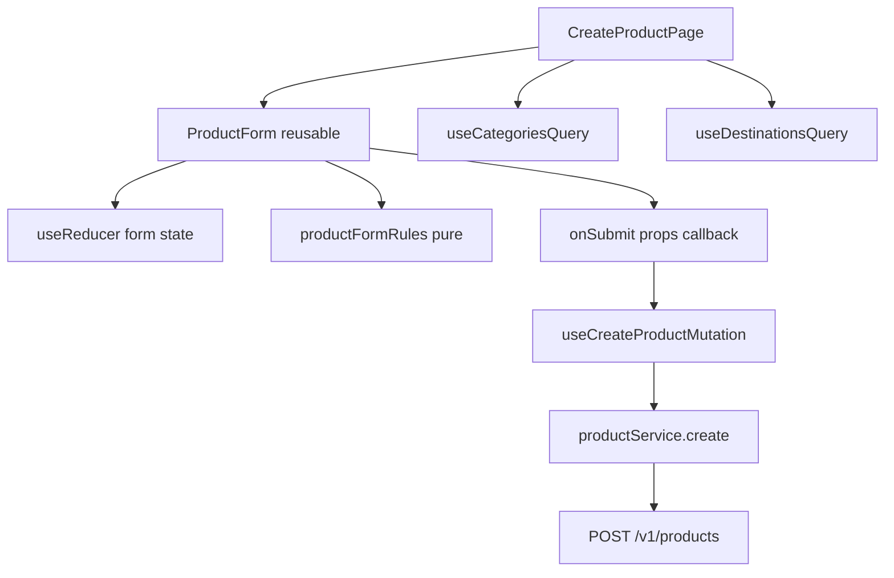

# Create product form (frontend only)

**Scope:** Frontend only. Assume BE endpoints exist (or will); do not implement backend here.

## UX / routing

- On [`ProductsPage`](frontend/src/view/pages/ProductsPage.tsx) (and shared header when that page is shown), **remove** the “Product manage” link and put **Create product** in the same header slot (before Sign out).
- Make [`AppHeader`](frontend/src/view/components/layout/AppHeader.tsx) accept an optional primary action prop, e.g. `primaryAction?: { label: string; to: string } | null`.
  - Default (Home / Edit stub): `{ label: 'Product manage', to: '/products' }`
  - Products list: `{ label: 'Create product', to: '/products/create' }`
- New route `/products/create` → `CreateProductPage` wrapped in `withAuth` in [`App.tsx`](frontend/src/App.tsx).
- On success: navigate to `/products` and invalidate `['products']` query cache.

## Assumed API contract

| Method | Path | Purpose |
|--------|------|---------|
| `GET` | `/api/v1/categories` | `{ data: [{ id, name }] }` |
| `GET` | `/api/v1/destinations` | `{ data: [{ id, name }] }` |
| `POST` | `/api/v1/products` | create; `201` + product resource; `422` field errors |

**Create body** (snake_case, matches BE `ProductData`):

```json
{
  "product_name": "...",
  "category_id": 1,
  "description": "...",
  "price": 99.99,
  "inventory_count": 10,
  "valid_from": "2026-01-01",
  "valid_until": "2026-12-31",
  "status": "Active",
  "destination_ids": [1, 2]
}
```

Auth via existing Bearer interceptor.

## Architecture



- View → service via React Query hooks (same pattern as list/delete).
- **Validation ≠ submit:** pure `validateProductForm(values) → Record<string, string>` in [`service/rules/productFormRules.ts`](frontend/src/service/rules/productFormRules.ts). Submit handler only runs if validation passes; server `ValidationError` merges into field errors.

## Reusable form (for future update)

Split so update can reuse without implementing update now:

| Piece | Role |
|-------|------|
| `types/ProductFormValues.ts` | Form value shape (camelCase) |
| `view/components/products/ProductForm.tsx` | Presentational + local `useReducer`; props: `initialValues`, `categories`, `destinations`, `busy`, `serverErrors?`, `submitLabel`, `onSubmit(values)` |
| `view/components/ui/FormField.tsx` | Label + control + `is-invalid` / `invalid-feedback` |
| `view/hooks/useProductFormReducer.ts` | Actions: `setField`, `setErrors`, `reset`, `setValues` |

**Fields:** product name, category (select), destinations (multi-select checkboxes or multi `<select>`), description (textarea), price, inventory count, valid from, valid until, status (`Active` / `Inactive`).

**FE validation rules (examples):** required strings; `categoryId` required; ≥1 destination; price > 0; inventory ≥ 0 integer; dates required; `validUntil` ≥ `validFrom`; status in enum.

## Create page

- [`CreateProductPage.tsx`](frontend/src/view/pages/CreateProductPage.tsx) + scss: `AppHeader` with create primary action hidden or back-friendly (primary action can be omitted / “Back to products”); load categories + destinations with `useQuery` on mount; show loading/error; render `ProductForm`; wire `useCreateProductMutation`.
- Responsive: Bootstrap `container` / `row` / `col-12 col-md-8 col-lg-6` form layout; full-width controls on mobile.

## API / service layer

- `api/endpoints/categoryEndpoints.ts`, `destinationEndpoints.ts`; extend `productEndpoints.ts` with `createProduct`.
- Responses + mappers; `categoryService` / `destinationService` or thin functions on existing product/lookup services.
- `productService.create(values)` maps camelCase → snake_case body, returns mapped `Product`.
- Hooks: `useCategoriesQuery`, `useDestinationsQuery`, `useCreateProductMutation` (invalidate `products` on success).

## Out of scope

- Backend categories/destinations/create implementation
- Update product page wiring (form is reusable only)
- AI generation / search
