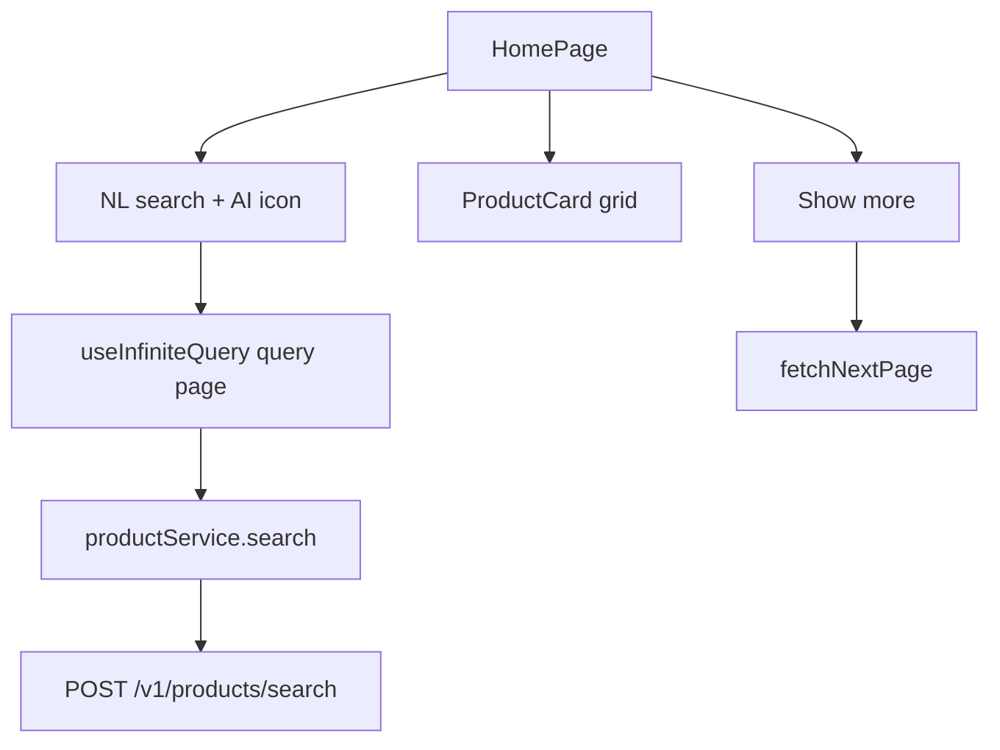

# Home product listing + NL search (frontend only)

**Scope:** Frontend only. Assume a paginated natural-language search API; do not implement backend here.

**Catalog vs manage list:** Home is a **browse/search catalog** of Active, currently-valid products (not the owner-only `/products` table). Search does not send `user_id`. Manage CRUD stays on `/products`.

## Assumed API contract

| Method | Path | Purpose |
|--------|------|---------|
| `POST` | `/api/v1/products/search` | NL search / browse; Bearer auth |

**Request body** (JSON):

```json
{
  "query": "dinner buffets in Colombo",
  "page": 1,
  "per_page": 8
}
```

- `query` — natural language text sent to the BE (empty string `""` = initial browse set on first load / Show more with no search yet)
- `page`, `per_page` — pagination
- Response: same Laravel paginator shape as product list (`data` + `meta`: `current_page`, `last_page`, `per_page`, `total`)
- Item shape: existing product resource (include `description`, `category`, `destinations`, price, dates, status)

**Why POST:** NL text can be long and is a search *command* payload, not a resource identifier—body is clearer than a query string.

## UX



- Keep [`AppHeader`](frontend/src/view/components/layout/AppHeader.tsx) (Product manage + Sign out).
- Top of main: search text field + adjacent **AI icon button** (submit search). Enter submits too.
- Below: responsive card grid (`col-12 col-sm-6 col-lg-4`).
- **Initial load:** `query: ''`, `page: 1`, `per_page: 8` (first page of cards).
- **Show more:** `fetchNextPage` with same `query`; appends pages. Hide when no `nextPage` or while fetching.
- New search (submit): set submitted query, reset infinite query to page 1 (replace list).
- Loading / empty / error states following existing page patterns.

### Card content
Reusable [`ProductCard`](frontend/src/view/components/products/ProductCard.tsx): name, truncated description, price, category, destinations (comma-separated), validity dates or status. No manage actions on home.

## Implementation

### API / service
- [`productEndpoints.ts`](frontend/src/api/endpoints/productEndpoints.ts): `searchProducts({ query, page, perPage })` → `POST /v1/products/search` with JSON body `{ query, page, per_page }`.
- [`productService.ts`](frontend/src/service/productService.ts): `searchProducts` → reuse `mapProductList`.
- Do **not** overload owner `listProducts` used by manage table.

### React Query
- **`useInfiniteQuery`** (`queryKey: ['products', 'search', query]`, `initialPageParam: 1`, `getNextPageParam` from `meta.last_page` / `current_page`).
- `queryFn` posts `{ query, page: pageParam, per_page: 8 }`.

### HomePage structure
- [`HomePage.tsx`](frontend/src/view/pages/HomePage.tsx): search UI + grid + Show more; still `withAuth`.
- Components:
  - `view/components/products/ProductSearchBar.tsx` — controlled input, AI icon submit, accessible labels
  - `view/components/products/ProductCard.tsx` + scss
  - optional `ProductCardGrid.tsx` for the Bootstrap row
- Styles: co-located scss; Bootstrap grid; touch-friendly Show more.

### Local search UX state
- `draftQuery` (input) vs `submittedQuery` (drives the infinite query) so typing does not refetch until submit.

## Out of scope
- Backend NL/AI search implementation
- Owner manage table changes
- Product detail page / card click navigation
- Filters beyond NL `query` + pagination
