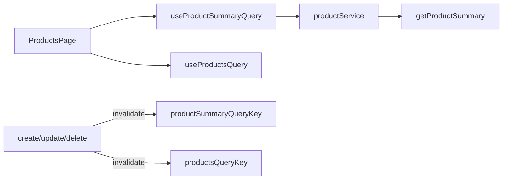

# Frontend: Product dashboard summary

## Scope

Frontend only. Assume this backend contract (not implemented yet; path uses plural `products` to match existing `/v1/products` APIs):

- **Method/path:** `GET /api/v1/products/summary`
- **Auth:** Sanctum (same as list/create)
- **Success `200`:**
  ```json
  {
    "data": {
      "total_products": 12,
      "active_products": 8,
      "expired_products": 3
    }
  }
  ```

**Count semantics for FE typing (BE must match):** scoped to the authenticated user’s owned products.

- `total_products` — all owned products
- `active_products` — `status === Active`
- `expired_products` — `valid_until` before today (any status)

## 1. Rename header CTA

In [`frontend/src/view/components/layout/AppHeader.tsx`](frontend/src/view/components/layout/AppHeader.tsx), change default primary action label from `Manage products` to **`Product dashboard`** (keep `to: '/products'`).

On [`ProductsPage.tsx`](frontend/src/view/pages/ProductsPage.tsx), update the page heading to **Product dashboard** (subtitle can stay short, e.g. “Overview of the travel products you own.”).

## 2. API / service / types layers

Follow [`frontend-architecture.mdc`](.cursor/rules/frontend-architecture.mdc):

| Layer | File | Work |
| --- | --- | --- |
| Response | `frontend/src/api/responses/productSummaryResponse.ts` | `{ data: { total_products, active_products, expired_products } }` |
| Endpoint | [`productEndpoints.ts`](frontend/src/api/endpoints/productEndpoints.ts) | `getProductSummary()` → `GET /v1/products/summary` + `mapAxiosError` |
| Domain type | `frontend/src/types/ProductSummary.ts` | camelCase: `totalProducts`, `activeProducts`, `expiredProducts` |
| Mapper | `frontend/src/service/mappers/productSummaryMapper.ts` | snake → camel |
| Service | [`productService.ts`](frontend/src/service/productService.ts) | `getProductSummary()` |

## 3. React Query hook + invalidation

- New [`useProductSummaryQuery.ts`](frontend/src/view/hooks/useProductSummaryQuery.ts):
  - `productSummaryQueryKey = ['products', 'summary'] as const`
  - `useQuery({ queryKey, queryFn: productService.getProductSummary })`

- Invalidate summary on mutations (alongside existing `productsQueryKey`):
  - [`useCreateProductMutation.ts`](frontend/src/view/hooks/useCreateProductMutation.ts)
  - [`useUpdateProductMutation.ts`](frontend/src/view/hooks/useUpdateProductMutation.ts)
  - [`useDeleteProductMutation.ts`](frontend/src/view/hooks/useDeleteProductMutation.ts)

  Use `queryClient.invalidateQueries({ queryKey: productSummaryQueryKey })` in each `onSuccess`.

## 4. UI on ProductsPage (dashboard)

Add a presentational component [`ProductSummaryStats.tsx`](frontend/src/view/components/products/ProductSummaryStats.tsx) (+ co-located SCSS if needed):

- Props: the three counts (numbers)
- Layout: Bootstrap `row` / `col-12 col-md-4` with three simple metric blocks (label + large number) — not heavy card chrome; matches existing Bootstrap dashboard page
- Labels exactly: **Total Products**, **Active Products**, **Expired Products**

Wire in [`ProductsPage.tsx`](frontend/src/view/pages/ProductsPage.tsx):

- Call `useProductSummaryQuery()` in parallel with `useProductsQuery`
- Render summary above the table
- Loading: short placeholder or skeleton text for the stats row
- Error: non-blocking alert for summary failure (table can still load independently)



## Out of scope

- Backend `/products/summary` implementation (separate BE task)
- Changing table columns or pagination behavior
- Computing counts client-side from the paginated list (must use the summary endpoint)
