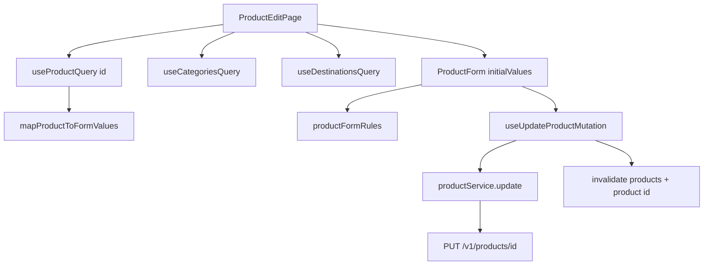

# Update product form (frontend only)

**Scope:** Frontend only. Assume BE `show` / `update` exist (or will); do not implement backend here.

**Reuse:** [`ProductForm`](frontend/src/view/components/products/ProductForm.tsx), [`validateProductForm`](frontend/src/service/rules/productFormRules.ts), categories/destinations hooks, and create-page error-handling patterns. Replace the stub in [`ProductEditPage.tsx`](frontend/src/view/pages/ProductEditPage.tsx) (route already `/products/:id/edit`).

## Assumed API contract

| Method | Path | Behavior |
|--------|------|----------|
| `GET` | `/api/v1/products/{id}` | Owner’s product; **404** if missing/foreign |
| `PUT` | `/api/v1/products/{id}` | Update; same body as create; `200` + product; `422` field errors |

**Show/update item** must include fields the form needs (list resource today omits `description` — show must include it):

```json
{
  "id": 1,
  "product_name": "...",
  "description": "...",
  "price": "100.00",
  "inventory_count": 10,
  "valid_from": "2026-01-01",
  "valid_until": "2026-12-31",
  "status": "Active",
  "category": { "id": 1, "name": "..." },
  "destinations": [{ "id": 1, "name": "..." }]
}
```

PUT body = same snake_case payload as create (`CreateProductPayload` / reuse `toCreateProductPayload`).

## Flow



## Implementation

### API / service
- Extend [`productEndpoints.ts`](frontend/src/api/endpoints/productEndpoints.ts): `getProduct(id)`, `updateProduct(id, payload)`.
- Extend [`ProductResponse`](frontend/src/api/responses/productResponse.ts) + [`Product`](frontend/src/types/Product.ts) with optional/required `description`.
- [`productMapper.ts`](frontend/src/service/mappers/productMapper.ts): map `description`; add `mapProductToFormValues(product) → ProductFormValues` (string fields for inputs; `categoryId` from `category.id`; `destinationIds` from destinations).
- [`productService.ts`](frontend/src/service/productService.ts): `getProduct(id)`, `updateProduct(id, values)` using existing `toCreateProductPayload`.

### React Query hooks
- `useProductQuery(id)` — `queryKey: ['products', id]`; enabled when `id` is a valid number.
- `useUpdateProductMutation()` — `mutationFn: ({ id, values })`; on success invalidate `['products']` and `['products', id]`.

### Shared helpers (DRY with create)
- Move `mapServerErrors` / field-name map out of [`CreateProductPage`](frontend/src/view/pages/CreateProductPage.tsx) into e.g. [`service/mappers/productFormErrorMapper.ts`](frontend/src/service/mappers/productFormErrorMapper.ts) (or `view` util). Use from both create and edit pages.

### ProductEditPage
- `withAuth`; `AppHeader` primary action **Back to products** → `/products` (same as create).
- Parse `:id` from `useParams`; invalid id → short error + link back.
- Parallel load: product + categories + destinations.
- Loading / error states (401 / connection / 404-as-Unexpected or Unauthorized handled like create).
- Render `ProductForm` **only after product is loaded**, with `initialValues={mapProductToFormValues(product)}` and `key={product.id}` so `useReducer` initializes correctly (no empty-then-fill flash).
- `submitLabel="Update product"`; on success `navigate('/products', { replace: true })`.
- Responsive layout: same `container` / `col-12 col-md-8 col-lg-6` as create.

### ProductForm
- No structural change required if edit only mounts with final `initialValues`. Keep validation/submit separation as today.

## Out of scope
- Backend show/update implementation
- Create-flow redesign
- AI / search
