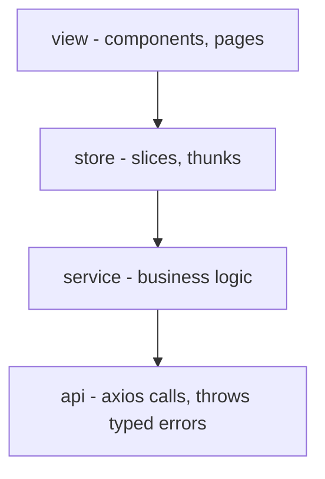

# Frontend Layered Architecture

## Layers

Three layers, one responsibility each. Dependencies point one way only.



- **view** - rendering and user interaction.
- **service** - business logic.
- **api** - HTTP calls, and turning failures into typed errors the frontend understands.

Rules:
- A component reaches lower layers through the store (`useAppSelector` / `useAppDispatch`). It does not import from `service/` or call endpoints. It may import error classes from `api/errors` for `instanceof` checks.
- A service never imports axios or the store.
- The api layer never imports the store or a component.

## Structure

```
src/
  api/
    client.ts
    errors.ts
    responses/                 # 200 body shape per endpoint
    endpoints/
      resourceEndpoints.ts
  service/
    resourceService.ts
    mappers/
    rules/
  store/
    index.ts
    hooks.ts
    slices/
  view/
    components/
    pages/
    hooks/                     # optional, for logic reused by 2+ components
  types/
```

## Layer 3 - api

### Backend response contract

- `200` - success. Body shape varies per endpoint, so there is no shared envelope: each endpoint declares its own type in `responses/`.
- `401` -> `UnauthorizedError`
- `422` - validation only. Body is an array of single-key objects -> `ValidationError`
- any other status -> `UnexpectedError` (`"Something went wrong"`). Frontend code throws the same type deliberately when it hits an impossible branch.
- no response at all (network down, timeout, CORS) -> `ConnectionError`

### Errors

All four in `src/api/errors.ts`. Same pattern for every class: `super` gets the class name. Only `ValidationError` carries data (`fields`).

```ts
export class UnauthorizedError extends Error {
  constructor() {
    super('UnauthorizedError');
  }
}

export class ValidationError extends Error {
  constructor(readonly fields: Record<string, string>) {
    super('ValidationError');
  }
}

export class UnexpectedError extends Error {
  constructor() {
    super('UnexpectedError');
  }
}

export class ConnectionError extends Error {
  constructor() {
    super('ConnectionError');
  }
}
```

### Endpoints

```ts
export async function fetchResources(): Promise<ResourceResponse[]> {
  try {
    const { data } = await client.get<ResourceResponse[]>('/resources');
    return data;
  } catch (error) {
    if (!isAxiosError(error) || !error.response) throw new ConnectionError();
    const { status, data } = error.response;
    if (status === 401) throw new UnauthorizedError();
    if (status === 422) throw new ValidationError(Object.assign({}, ...(data ?? [])));
    throw new UnexpectedError();
  }
}
```

**Client** is one axios instance: `baseURL` from `import.meta.env.VITE_API_BASE_URL`, timeout, `Accept: application/json`, and a request interceptor for auth headers.

## Layer 2 - service

- One exported function per use case (`loadVisibleResources`, `submitResource`).
- Owns orchestration, mapping response -> domain model, and business rules.
- Mappers and rules are pure functions in their own files.
- Lets api errors propagate; only catches when a business rule needs a fallback.

## Layer 2 - store (Redux Toolkit)

Thunk calls one service function and rejects with the error:

```ts
export const loadResources = createAsyncThunk(
  'resources/load',
  async (_, { rejectWithValue }) => {
    try {
      return await resourceService.loadResources();
    } catch (error) {
      return rejectWithValue(error as Error);
    }
  },
);
```

Slice stores the error as-is. No branching here:

```ts
.addCase(loadResources.rejected, (state, action) => {
  state.resource.error = action.payload;
})
```

Disable RTK's serializability check in `configureStore` so storing an `Error` does not warn in development:

```ts
middleware: (getDefaultMiddleware) =>
  getDefaultMiddleware({ serializableCheck: false }),
```

## Layer 1 - view

- Presentational components: props in, markup out.
- Connected components: may use `useAppSelector`, `useAppDispatch`, and local `useState`.
- Component reads `error` from state and decides what to do:

```ts
if (error instanceof ValidationError) {
  // show field errors on the form
} else if (error instanceof UnauthorizedError) {
  // redirect to login
} else if (error instanceof UnexpectedError) {
  // show error popup with message
} else if (error instanceof ConnectionError) {
  // show error popup with message
}
```

- Styling follows [`.cursor/rules/styles.mdc`](.cursor/rules/styles.mdc).

## Setup changes

- Add `axios`, `@reduxjs/toolkit`, `react-redux`.
- Add `@/` alias in vite + tsconfig.
- Wrap app in `<Provider store={store}>` in `main.tsx`.
- Add `.env.example` with `VITE_API_BASE_URL`.
- Add `.cursor/rules/frontend-architecture.mdc`.

## Naming conventions

- Endpoint: `{resource}Endpoints.ts`; service: `{area}Service.ts`; mapper: `{resource}Mapper.ts`.
- Slice: `{resource}Slice.ts`, thunk names `'{resource}/{action}'`.
- Domain model in `types/` (`Resource`); response type in `api/responses/` (`ResourceResponse`).
