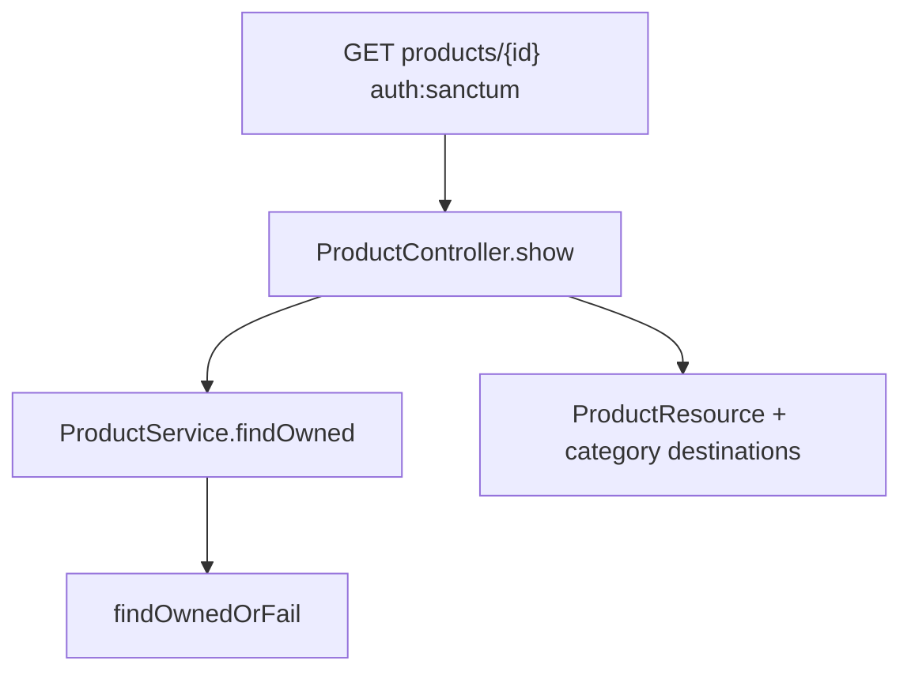

# Fix GET /api/v1/products/{id}

## Cause

Laravel reports **“The GET method is not supported”** because [`backend/routes/api.php`](backend/routes/api.php) only registers `GET products` (index), `POST`, `PUT`, and `DELETE` — not `GET products/{product}`.

[`ProductController::show`](backend/app/Http/Controllers/Api/V1/ProductController.php) exists but is a stub (`BadMethodCallException`). The frontend already calls this URL from [`getProduct`](frontend/src/api/endpoints/productEndpoints.ts) for [`ProductEditPage`](frontend/src/view/pages/ProductEditPage.tsx).

## Approach

Wire show through the existing 3-layer stack, **owner-scoped** (same as update/delete), behind `auth:sanctum`.



### 1. Route — [`backend/routes/api.php`](backend/routes/api.php)

Inside the `auth:sanctum` group, add:

```php
Route::get('products/{product}', [ProductController::class, 'show']);
```

Place it with the other product routes (after `POST products` is fine).

### 2. Service — [`ProductService`](backend/app/Services/ProductService.php)

`find()` already uses `findOrFail` and has no callers. Replace it with ownership:

```php
public function findOwned(int $id, int $userId): Product
{
    return $this->products->findOwnedOrFail($id, $userId);
}
```

Repository methods already exist — no interface/repo changes.

### 3. Controller — [`ProductController::show`](backend/app/Http/Controllers/Api/V1/ProductController.php)

```php
public function show(Request $request, int $product): ProductResource
{
    $found = $this->products->findOwned($product, $request->user()->id);

    return new ProductResource($found->load(['category', 'destinations']));
}
```

Response shape matches update/`ProductResource` (fields + `category` + `destinations`).

### 4. Tests

**Feature** ([`ProductControllerTest`](backend/tests/Feature/ProductControllerTest.php)):

- Unauthenticated GET → 401
- Owned product → 200 with product fields + relations
- Another user’s product → 404
- Missing id → 404

**Unit** ([`ProductServiceTest`](backend/tests/Unit/ProductServiceTest.php)):

- `findOwned` forwards to `repository->findOwnedOrFail`

## Out of scope

- Frontend changes (already wired)
- Public/unauthenticated product detail
