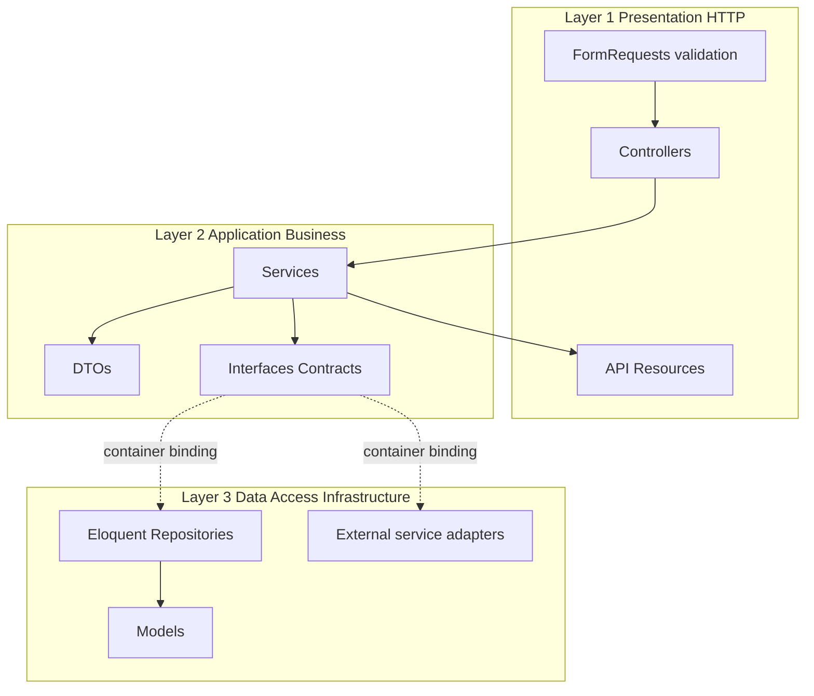

# Laravel 3-Layer Architecture

## Current state

- Laravel 13 skeleton; only `web.php` is registered in [backend/bootstrap/app.php](backend/bootstrap/app.php), so there is no `routes/api.php`
- Models and enums already exist under [backend/app/Models](backend/app/Models) and [backend/app/Enums](backend/app/Enums)
- Only the base [backend/app/Http/Controllers/Controller.php](backend/app/Http/Controllers/Controller.php) exists; no services, repositories, requests, or resources
- The client is a separate SPA, so the backend is a JSON API

## The three layers



### Layer 1 - Presentation (HTTP)

Owns everything that is HTTP-specific and nothing else.

- Controllers: translate a request into a DTO, call exactly one service method, return a Resource. No `if` chains of business logic, no Eloquent, no third-party clients.
- FormRequests: all input validation and authorization rules.
- API Resources: response shaping and serialization.
- Routes: versioned groups so the contract can evolve.

### Layer 2 - Application (Business)

The only layer that knows the business rules.

- Services: orchestrate a use case, enforce invariants, run inside transactions when several writes must succeed together. They accept and return DTOs or models, never `Request` or `Response` objects.
- DTOs: readonly, typed carriers that cross layer boundaries instead of loose arrays.
- Contracts: interfaces for everything the service depends on (persistence, external services). The service depends on these, never on concrete classes.

### Layer 3 - Data Access (Infrastructure)

The only layer allowed to touch the database or the network.

- Repositories: implement the persistence contracts, own all query building, and centralize shared filters so no caller can bypass them.
- Models: relationships, casts, and query scopes only; no orchestration.
- External adapters: wrap third-party SDKs or HTTP calls, translate responses into DTOs, and throw domain exceptions on failure.

## Folder structure

```
backend/app/
  Contracts/
    Repositories/         # persistence interfaces
    Integrations/         # external service interfaces
  DataTransferObjects/    # readonly input and output DTOs
  Services/               # one service per feature area
  Repositories/
    Eloquent/             # Eloquent implementations of the contracts
  Infrastructure/         # HTTP clients and third-party adapters
  Http/
    Controllers/Api/V1/   # thin, versioned controllers
    Requests/             # validation
    Resources/            # response shaping
  Providers/
    DomainServiceProvider.php
  Exceptions/             # domain-specific exceptions
  Models/                 # existing
  Enums/                  # existing
backend/routes/
  api.php
backend/tests/
  Unit/                   # services with fake collaborators
  Feature/                # HTTP endpoints end to end
```

## Concepts, applied

### Inversion of Control / Dependency Injection

No class calls `new` on its collaborators; the Laravel container injects them. All bindings live in one place, [backend/app/Providers/DomainServiceProvider.php](backend/app/Providers/DomainServiceProvider.php):

```php
public function register(): void
{
    $this->app->bind(EntityRepositoryInterface::class, EloquentEntityRepository::class);
    $this->app->bind(ExternalServiceInterface::class, HttpExternalService::class);
}
```

Register the provider in [backend/bootstrap/providers.php](backend/bootstrap/providers.php). Swapping an implementation for a fake in tests then costs one `$this->app->bind(...)` line.

### OOP

- Encapsulation: invariants live inside services and models, not in controllers; readonly DTOs cannot be half-constructed.
- Abstraction: interfaces expose the intent (`get`, `save`, `send`) and hide query building, prompt construction, and response parsing.
- Polymorphism: a real adapter and a fake adapter are interchangeable behind the same interface.
- Inheritance only where the framework requires it (`Model`, `FormRequest`, `JsonResource`); prefer composition everywhere else.

### SOLID

- SRP: controller does HTTP, service does rules, repository does queries.
- OCP: a new provider or storage backend is a new class plus one binding, with no service edits.
- LSP: fakes must honour the same contract and return the same DTO types as the real implementations.
- ISP: several narrow interfaces rather than one wide interface that implementations only partially satisfy.
- DIP: services depend on `Contracts\...`, and the container supplies the concrete class.

### Design patterns

- Repository: centralizes persistence and shared query filters so business rules cannot be bypassed.
- Service Layer: one entry point per use case, keeping controllers and models thin.
- DTO: typed data crossing layer boundaries instead of associative arrays.
- Adapter: wraps a third-party client so the rest of the app depends on our interface, not theirs.
- Strategy: interchangeable implementations behind a contract, chosen by configuration or environment.
- Query Object: a criteria DTO describing filters, translated into a query by the repository.
- Factory: static `fromRequest()` / `fromArray()` constructors that build validated DTOs from untrusted input.

## Implementation steps

### 1. Enable API routing

In [backend/bootstrap/app.php](backend/bootstrap/app.php), add `api: __DIR__.'/../routes/api.php'` to `withRouting()` (the `api` prefix is applied automatically), then create [backend/routes/api.php](backend/routes/api.php) with a `v1` group and `Route::apiResource(...)` entries per feature.

### 2. Layer 3 - data access

Define a repository interface per aggregate under `app/Contracts/Repositories` covering the read and write operations the services need, then implement it in `app/Repositories/Eloquent` against the existing models. Push reusable filters into model scopes so both the repository and ad-hoc queries share one definition.

Add external-service adapters under `app/Infrastructure`, each implementing an interface from `app/Contracts/Integrations`, configured through [backend/config/services.php](backend/config/services.php) and throwing a dedicated exception from `app/Exceptions` on failure.

### 3. Layer 2 - services and DTOs

Create readonly DTOs in `app/DataTransferObjects` for write payloads and for query criteria. Create one service per feature area in `app/Services`, constructor-injecting only interfaces. Services validate business rules that FormRequests cannot express, and wrap multi-write operations in `DB::transaction`.

### 4. Layer 1 - HTTP

FormRequests hold all field validation. Controllers stay at a few lines each:

```php
public function store(StoreEntityRequest $request): EntityResource
{
    return new EntityResource(
        $this->service->create(EntityData::fromRequest($request))
    );
}
```

Resources define the JSON shape, including nested relations and computed attributes.

### 5. Tests

- `tests/Unit`: services tested against fake repositories and fake integrations, asserting business rules.
- `tests/Feature`: endpoints tested end to end with the real database, binding fakes for anything that would hit the network.

## Explicitly out of scope

- CQRS, event sourcing, or a full hexagonal module layout beyond the external-service boundary
- Repositories for aggregates that have no use case yet; those stay plain Eloquent until one appears
- Authentication and authorization layers
