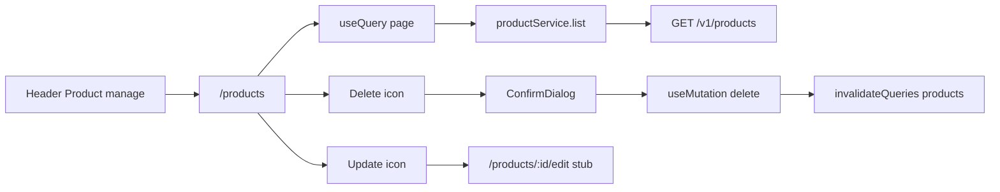

# Product manage table (frontend only)

**Scope:** Frontend only. No backend changes in this work.

**Library choice:** `@tanstack/react-query` + `@tanstack/react-table`. Redux stays for auth; product list/delete are server state via React Query.

**Ownership (FE expectation):** The manage page shows **the current user’s products only**. Ownership is enforced by the API (`auth:sanctum` + server-side `user_id` filter). The FE does not send a `user_id` and does not list a global catalog.

## Assumed API contract (do not implement here)

Auth Bearer token from existing [`localStorageService`](frontend/src/service/localStorageService.ts) / axios interceptor.

- `GET /api/v1/products?page=&per_page=` → Laravel paginator of the auth user’s Active products
- `DELETE /api/v1/products/{id}` → `204`; foreign/missing id → `404`

**Item shape** (table columns):

```json
{
  "id": 1,
  "product_name": "...",
  "price": "100.00",
  "inventory_count": 10,
  "valid_from": "2026-01-01",
  "valid_until": "2026-12-31",
  "status": "Active",
  "category": { "id": 1, "name": "..." },
  "destinations": [{ "id": 1, "name": "..." }]
}
```

Paginator envelope: `data` + `meta` (`current_page`, `last_page`, `per_page`, `total`) — mapper normalizes either Laravel resource collection meta shape.

## Frontend flow



### Shared header
- New [`view/components/layout/AppHeader.tsx`](frontend/src/view/components/layout/AppHeader.tsx): brand/title left; **Product manage** then **Sign out** on the right when authenticated.
- Use on Home, Products list, and Edit stub.

### Routes (auth-wrapped)
- `/products` → `ProductsPage` (`withAuth`)
- `/products/:id/edit` → stub `ProductEditPage` (`withAuth`) — “Update form coming soon”
- Wire in [`App.tsx`](frontend/src/App.tsx)

### API / service
- `api/responses/productResponse.ts`, `api/endpoints/productEndpoints.ts` — `listProducts({ page, perPage })`, `deleteProduct(id)`
- `service/productService.ts` + `mappers/productMapper.ts` — map paginator → `{ items, page, pageCount, total, perPage }` in `types/Product.ts`
- View must not import endpoints; React Query hooks call **service** only

### React Query
- Add `@tanstack/react-query`; `QueryClientProvider` in [`main.tsx`](frontend/src/main.tsx)
- `view/hooks/useProductsQuery.ts` — `useQuery({ queryKey: ['products', page], queryFn })`
- `view/hooks/useDeleteProductMutation.ts` — on success `invalidateQueries({ queryKey: ['products'] })`
- Pagination: Prev/Next + page indicator drive `page` state

### Table (TanStack Table)
- Add `@tanstack/react-table`
- `view/pages/ProductsPage.tsx` + `view/components/products/ProductsTable.tsx`
- Columns: name, category, destinations (comma-separated), price, inventory, valid from/until, status, actions
- Last column: update → `/products/${id}/edit`; delete → confirm dialog
- **Responsive:** Bootstrap `table-responsive` + grid for header/pagination

### Reusable confirm popup
- `view/components/feedback/ConfirmDialog.tsx` — `open`, `title`, `message`, `confirmLabel`, `onConfirm`, `onCancel`, `busy`
- Bootstrap modal; ProductsPage wires delete only

## Out of scope
- Any backend / migration / seed work
- Create product / full update form / AI / search
- Product filters beyond pagination
- RTK Query
